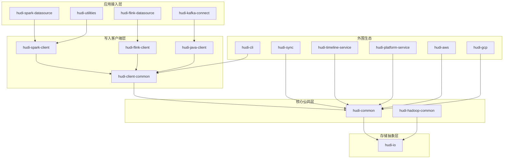

# Apache Hudi 工程架构全面解析

> **版本**: 1.2.0-SNAPSHOT (master 分支)  
> **文档日期**: 2026-04-21  
> **说明**: 本文档基于源码深度分析，系统性阐述 Hudi 的工程架构设计、模块职责、设计模式与核心特性。

---

## 一、项目概览

Apache Hudi（Hadoop Upserts Deletes and Incrementals）是一个开源的**数据湖仓平台（Data Lakehouse Platform）**，构建在高性能的开放表格式（Open Table Format）之上，支持在多种云数据环境中对数据进行摄取、索引、存储、服务、转换和管理。

### 1.1 核心定位

```
传统数仓 ←→ Hudi 数据湖仓 ←→ 数据湖
```

Hudi 的核心价值在于**在数据湖的开放存储之上，叠加了数据仓库的事务性和管理能力**：
- **开放格式**: 所有数据和元数据都以 Parquet/Avro/HFile 等开放格式存储在云存储上
- **事务语义**: 提供 ACID 事务保证，支持原子性 commit/rollback
- **流批一体**: 同时支持批处理和流式处理，是真正的流批一体引擎

### 1.2 技术栈概览

| 技术领域 | 选型 |
|---------|------|
| 编程语言 | Java 11+ (核心)、Scala 2.12/2.13 (Spark 集成) |
| 构建工具 | Maven 多模块 (3014 行 pom.xml) |
| 序列化框架 | Apache Avro (主要)、Protobuf (元数据)、Kryo (Spark 序列化) |
| 存储格式 | Parquet (列式)、Avro (行式/日志)、HFile (索引) |
| 计算引擎 | Apache Spark 3.3~4.0、Apache Flink 1.17~2.1 |
| 元数据同步 | Hive Metastore、AWS Glue、DataHub、ADB |
| 分布式锁 | ZooKeeper、DynamoDB、文件系统锁 |
| 云平台 | AWS (S3/Glue/DynamoDB)、GCP (GCS/PubSub/BigQuery) |

---

## 二、工程模块架构

### 2.1 整体模块拓扑

Hudi 采用经典的**分层架构 + 多模块 Maven 工程**，根 pom.xml 中定义了约 50 个模块（包含顶级模块、子模块和 packaging 模块）。按职责可分为以下六层：

```
┌─────────────────────────────────────────────────────────────────┐
│                      应用接入层 (Application Layer)              │
│  hudi-spark-datasource │ hudi-flink-datasource │ hudi-kafka-connect │
├─────────────────────────────────────────────────────────────────┤
│                      写入客户端层 (Client Layer)                 │
│  hudi-client-common │ hudi-spark-client │ hudi-flink-client │ hudi-java-client │
├─────────────────────────────────────────────────────────────────┤
│                      表服务层 (Table Service Layer)              │
│  Compaction │ Clustering │ Clean │ TTL │ Index │ Archive │ Rollback │
├─────────────────────────────────────────────────────────────────┤
│                      核心公共层 (Common Layer)                   │
│  hudi-common: Timeline │ FileSystemView │ Table │ Model │ Config │ Schema │
├─────────────────────────────────────────────────────────────────┤
│                      I/O 存储抽象层 (Storage Abstraction Layer)    │
│  hudi-io: HoodieStorage │ StoragePath │ HFile Reader │ Log Format │
├─────────────────────────────────────────────────────────────────┤
│                      外围生态层 (Ecosystem Layer)                 │
│  hudi-sync │ hudi-utilities │ hudi-cli │ hudi-timeline-service │
│  hudi-platform-service │ hudi-aws │ hudi-gcp │ hudi-kafka-connect │
│  hudi-trino-plugin (独立构建) │ hudi-examples │ hudi-tests-common │
└─────────────────────────────────────────────────────────────────┘
```

### 2.2 核心模块详解

#### 2.2.1 `hudi-io` — 存储抽象层

**设计意图**: 将 Hudi 与具体的文件系统实现（HDFS、S3、GCS 等）**完全解耦**。

```
hudi-io/
├── storage/
│   ├── HoodieStorage.java          # 统一存储抽象接口
│   ├── StoragePath.java            # 路径抽象（替代 Hadoop Path）
│   ├── StorageConfiguration.java   # 存储配置抽象
│   ├── StoragePathInfo.java        # 文件信息抽象
│   └── StorageSchemes.java         # 支持的存储协议枚举
├── io/
│   ├── hfile/                      # 自研 HFile Reader
│   └── ...
```

**为什么这么设计**:
- **去 Hadoop 化**: Hudi 正在逐步减少对 Hadoop API 的直接依赖，`HoodieStorage` 接口使得底层可以接入任何对象存储
- **轻量化**: 自研 HFile Reader 避免了引入庞大的 HBase 依赖，仅实现 Hudi Metadata Table 所需的读取功能
- **跨引擎通用**: 该层不依赖任何计算引擎，可被 Spark/Flink/Java 独立客户端复用

#### 2.2.2 `hudi-common` — 核心公共层

**设计意图**: 承载所有跨引擎共享的核心抽象，是整个项目的**基石**。

```
hudi-common/src/main/java/org/apache/hudi/
├── common/
│   ├── model/          # 数据模型：HoodieRecord, HoodieKey, FileSlice, HoodieBaseFile 等
│   ├── table/          # 表格式核心：HoodieTableMetaClient, HoodieTableConfig
│   │   ├── timeline/   # ★ Timeline 机制：HoodieTimeline, HoodieInstant, HoodieActiveTimeline
│   │   ├── view/       # ★ 文件系统视图：TableFileSystemView, HoodieTableFileSystemView
│   │   ├── log/        # 日志格式：HoodieLogFormat, HoodieLogFileReader, LogBlock
│   │   ├── read/       # 统一读取器：HoodieFileGroupReader
│   │   └── cdc/        # CDC 变更数据捕获
│   ├── engine/         # 引擎抽象：HoodieEngineContext, HoodieReaderContext
│   ├── config/         # 配置体系
│   ├── lock/           # 锁抽象：LockProvider
│   ├── bloom/          # 布隆过滤器
│   └── schema/         # Schema 管理与演进
├── metadata/           # ★ Metadata Table 子系统
├── index/              # 索引抽象（record index, expression index, secondary index）
├── timeline/           # Timeline 元数据
├── config/             # 通用配置
└── keygen/             # Key 生成器
```

**关键设计模式**:

1. **Timeline 机制** — Hudi 最核心的设计创新
   - 每次写操作对应一个 `HoodieInstant`（包含 timestamp + action + state）
   - `HoodieTimeline` 维护所有 instant 的有序序列，是**事务日志**的抽象
   - 分为 `ActiveTimeline`（活跃 instant）和 `ArchivedTimeline`（归档 instant）

2. **FileSystemView** — 多种实现的文件视图
   - `HoodieTableFileSystemView`: 基于内存的默认实现
   - `RocksDbBasedFileSystemView`: 基于 RocksDB 的大表实现
   - `SpillableMapBasedFileSystemView`: 可溢出到磁盘的实现
   - `RemoteHoodieTableFileSystemView`: 远程 Timeline Server 上的实现
   - `PriorityBasedFileSystemView`: 融合本地和远程的优先级实现

3. **引擎上下文抽象** (`HoodieEngineContext`)
   ```java
   // 让核心逻辑无需感知底层是 Spark RDD / Flink DataStream / Java Stream
   public abstract class HoodieEngineContext {
       abstract <I, O> List<O> map(List<I> data, SerializableFunction<I, O> func, int parallelism);
       abstract <I, O> List<O> flatMap(List<I> data, SerializableFunction<I, Stream<O>> func, int parallelism);
       // ...
   }
   ```

#### 2.2.3 `hudi-client` — 写入客户端层

**设计意图**: 采用**模板方法 + 策略模式**，将写入逻辑的公共流程抽取到 `hudi-client-common`，引擎特定实现下沉到子模块。

```
hudi-client/
├── hudi-client-common/    # ★ 引擎无关的写入逻辑
│   ├── client/
│   │   ├── BaseHoodieWriteClient.java       # 核心写入客户端（约 83KB 大文件）
│   │   ├── BaseHoodieTableServiceClient.java # 表服务客户端基类
│   │   └── transaction/                      # 事务管理 & 冲突解决
│   ├── table/
│   │   ├── HoodieTable.java                 # 表抽象（分发 action 到具体执行器）
│   │   └── action/                          # ★ 表服务动作执行器
│   │       ├── commit/     # 提交
│   │       ├── compact/    # 压缩
│   │       ├── cluster/    # 聚簇
│   │       ├── clean/      # 清理
│   │       ├── rollback/   # 回滚
│   │       ├── restore/    # 恢复
│   │       ├── savepoint/  # 保存点
│   │       ├── index/      # 索引构建
│   │       └── ttl/        # 数据过期
│   └── index/              # 索引实现（Bloom, Bucket, Simple, InMemory）
├── hudi-spark-client/     # Spark 引擎适配
├── hudi-flink-client/     # Flink 引擎适配
└── hudi-java-client/      # 纯 Java 引擎适配
```

**为什么这么分层**:
- `BaseHoodieWriteClient` 定义了完整的写入流程模板（start commit → write → index → commit/rollback）
- 各引擎子模块只需实现数据分区、shuffle、并行执行等引擎特定逻辑
- **避免了在 Spark/Flink/Java 三套代码中重复实现事务管理、索引更新、表服务调度等核心逻辑**

#### 2.2.4 `hudi-spark-datasource` — Spark 数据源集成

**设计意图**: 通过**版本适配层 (shim) 模式**，支持多个 Spark 版本共存。

```
hudi-spark-datasource/
├── hudi-spark-common/     # 所有 Spark 版本共享的逻辑
├── hudi-spark3-common/    # Spark 3.x 共享逻辑
├── hudi-spark3.3.x/       # Spark 3.3 特定适配
├── hudi-spark3.4.x/       # Spark 3.4 特定适配
├── hudi-spark3.5.x/       # Spark 3.5 特定适配（当前默认）
├── hudi-spark4-common/    # Spark 4.x 共享逻辑
├── hudi-spark4.0.x/       # Spark 4.0 特定适配
└── hudi-spark/            # 统一入口模块
```

**这种设计的优势**:
- **渐进式演进**: 新增 Spark 版本支持只需增加一个 `hudi-sparkX.Y.x` 模块
- **最大化代码复用**: 95% 以上的 Spark 集成逻辑在 `common` 模块中共享
- **编译隔离**: 不同 Spark 版本的 API 不兼容部分通过 Maven Profile 隔离

#### 2.2.5 `hudi-flink-datasource` — Flink 数据源集成

与 Spark 数据源采用相同的分层策略：

```
hudi-flink-datasource/
├── hudi-flink/            # 核心 Flink 集成（source, sink, table, streamer）
├── hudi-flink1.17.x/      # Flink 1.17 适配
├── hudi-flink1.18.x/      # Flink 1.18 适配
├── hudi-flink1.19.x/      # Flink 1.19 适配
├── hudi-flink1.20.x/      # Flink 1.20 适配（当前默认）
├── hudi-flink2.0.x/       # Flink 2.0 适配
└── hudi-flink2.1.x/       # Flink 2.1 适配
```

#### 2.2.6 外围生态模块

| 模块 | 职责 | 为什么需要 |
|------|------|-----------|
| `hudi-sync` | 将 Hudi 表元数据同步到外部 Catalog | 让 Hive/Presto/Trino 等查询引擎感知 Hudi 表 |
| `hudi-utilities` | 内置数据摄取工具（DeltaStreamer/HoodieStreamer） | 提供开箱即用的 CDC、Kafka、S3 等数据源接入能力 |
| `hudi-cli` | 命令行管理工具 | 运维场景下查看表状态、触发 compaction/clustering 等 |
| `hudi-timeline-service` | Timeline Server 服务 | 减少大规模表的文件系统 listing 开销 |
| `hudi-platform-service` | 平台服务（包含 hudi-metaserver） | 元数据服务器，提供集中式元数据管理 |
| `hudi-aws` | AWS 平台集成 | S3、Glue Catalog、DynamoDB Lock Provider |
| `hudi-gcp` | GCP 平台集成 | GCS、BigQuery、PubSub |
| `hudi-trino-plugin` | Trino 查询引擎插件（独立构建） | 让 Trino 直接读取 Hudi 表，需通过 profile 激活 |
| `hudi-kafka-connect` | Kafka Connect Sink | 让 Kafka 数据直接写入 Hudi |

#### 2.2.7 `packaging` — Bundle 打包

**设计意图**: 通过 Maven Shade Plugin 将复杂的依赖树打包成**单一 fat jar**。

```
packaging/
├── hudi-spark-bundle/              # Spark 环境的一体化 jar
├── hudi-flink-bundle/              # Flink 环境的一体化 jar
├── hudi-utilities-bundle/          # Utilities 一体化 jar
├── hudi-utilities-slim-bundle/     # Utilities 精简版 jar
├── hudi-hive-sync-bundle/          # Hive 同步专用 jar
├── hudi-datahub-sync-bundle/       # DataHub 同步专用 jar
├── hudi-kafka-connect-bundle/      # Kafka Connect 专用 jar
├── hudi-presto-bundle/             # Presto 查询专用 jar
├── hudi-trino-bundle/              # Trino 查询专用 jar
├── hudi-hadoop-mr-bundle/          # Hadoop MapReduce 专用 jar
├── hudi-cli-bundle/                # CLI 工具专用 jar
├── hudi-aws-bundle/                # AWS 集成专用 jar
├── hudi-gcp-bundle/                # GCP 集成专用 jar
├── hudi-timeline-server-bundle/    # Timeline Server 独立部署 jar
├── hudi-metaserver-server-bundle/  # MetaServer 独立部署 jar
├── hudi-integ-test-bundle/         # 集成测试专用 jar
└── bundle-validation/              # Bundle 验证工具
```

**为什么需要 Bundle**:
- 大数据生态中**依赖冲突**极其严重（Jackson、Avro、Protobuf 版本冲突）
- Bundle 通过 **shade relocation** 将冲突依赖重命名到 `org.apache.hudi.*` 命名空间下
- 用户只需引入一个 jar 就能使用 Hudi，极大降低了集成成本

---

## 三、核心设计理念与特性

### 3.1 表格式设计：COW vs MOR

#### 3.1.1 解决什么问题

**核心问题**: 在数据湖场景下,如何平衡**写入性能**与**查询性能**的矛盾?

- **传统数据湖的困境**: Parquet 等列式格式查询快但更新慢(需要重写整个文件),而行式格式更新快但查询慢
- **业务场景差异**: 
  - 批处理场景(如每日 ETL):写入频率低,查询频繁,需要极致的查询性能
  - 流式场景(如 CDC 实时同步):写入频繁(秒级/分钟级),查询相对较少,需要极致的写入性能
- **如果没有这个设计**: 用户只能在"快速写入"和"快速查询"之间二选一,无法在同一套系统中兼顾两种场景

**源码证据**:
```java
// 文件: hudi-common/src/main/java/org/apache/hudi/common/model/HoodieTableType.java:30
public enum HoodieTableType {
  // Performs upserts by versioning entire files, with later versions containing newer value of a record.
  COPY_ON_WRITE, 
  // Speeds up upserts, by delaying merge until enough work piles up.
  MERGE_ON_READ
}
```

#### 3.1.2 有什么坑

1. **MOR 表的查询性能陷阱**
   - **问题**: 如果长时间不执行 Compaction,Log Files 会无限堆积,导致查询时需要合并大量 Log 文件,性能急剧下降
   - **表现**: 查询延迟从秒级退化到分钟级,甚至 OOM
   - **根因**: MOR 表的查询需要实时合并 Base File + Log Files,Log 文件越多,合并开销越大
   - **解决**: 必须配置合理的 Compaction 策略(`hoodie.compact.inline.max.delta.commits`),建议不超过 10 个 delta commits

2. **COW 表的小文件问题**
   - **问题**: 频繁的小批量更新会产生大量小 Parquet 文件,严重影响查询性能和元数据管理
   - **表现**: HDFS NameNode 压力大,Spark 查询时 task 数量爆炸
   - **根因**: COW 表每次更新都重写整个文件,如果更新的记录很少,会产生大量小文件
   - **解决**: 启用 Clustering(`hoodie.clustering.inline=true`)定期重组文件布局

3. **表类型选择错误**
   - **坑**: 在高频写入场景(如 Kafka CDC)使用 COW 表,导致写入吞吐量低、延迟高
   - **坑**: 在低频写入、高频查询场景(如数仓 ODS 层)使用 MOR 表,导致查询性能差且 Compaction 成本高
   - **原则**: 
     - 写入频率 > 1次/分钟 → MOR
     - 写入频率 < 1次/小时 → COW
     - 中间地带根据查询/写入比例权衡

4. **Read-Optimized Query 的数据新鲜度陷阱**
   - **问题**: MOR 表的 Read-Optimized Query 只读 Parquet,跳过未 compact 的 Log Files,导致读到的数据不是最新的
   - **表现**: 业务方反馈"数据延迟",但实际上数据已经写入,只是查询方式不对
   - **解决**: 明确告知用户 MOR 表有两种查询模式:Snapshot Query(实时,慢) vs Read-Optimized Query(快,但可能不是最新)

#### 3.1.3 核心概念解释

**Copy-On-Write (COW)**:
- **写入语义**: 每次更新时,读取旧的 Parquet 文件,与新数据合并后,生成新版本的 Parquet 文件
- **文件结构**: 每个 FileSlice 只包含一个 Parquet 文件(`HoodieBaseFile`),无 Log Files
- **查询语义**: 直接读取最新版本的 Parquet 文件,无需额外合并操作
- **适用场景**: 批处理、数仓 ODS/DWD 层、读多写少

**Merge-On-Read (MOR)**:
- **写入语义**: 增量数据以 Avro 格式追加写入 Log Files(`HoodieLogFile`),无需读取旧数据
- **文件结构**: 每个 FileSlice 包含一个 Base Parquet 文件 + 多个 Log Files
- **查询语义**: 
  - **Snapshot Query**: 读取 Base File + 所有 Log Files,实时合并(慢但数据最新)
  - **Read-Optimized Query**: 只读取 Base File,跳过 Log Files(快但数据可能不是最新)
- **Compaction**: 后台异步将 Log Files 合并回 Parquet,生成新的 Base File
- **适用场景**: 流式写入、CDC 同步、写多读少

**关键差异对比**:
| 维度 | COW | MOR |
|------|-----|-----|
| 写入延迟 | 高(需要读取+重写 Parquet) | 低(仅追加 Log) |
| 查询延迟 | 低(直接读 Parquet) | 中(需合并 Base+Log) |
| 存储空间 | 中(仅 Parquet) | 高(Parquet + Log) |
| 写入吞吐 | 低 | 高 |
| 查询吞吐 | 高 | 中 |

#### 3.1.4 设计理念

**为什么这样设计**:

1. **LSM-Tree 思想的借鉴**
   - MOR 表的设计借鉴了 LSM-Tree(Log-Structured Merge-Tree)的核心思想:将随机写转化为顺序写
   - Log Files 的追加写入是顺序 I/O,在云存储(S3/GCS)上性能远优于随机读写
   - Compaction 类似 LSM-Tree 的 Compaction,将多层数据合并为一层

2. **读写分离的权衡**
   - COW 将写入成本前置(写时合并),查询时零成本
   - MOR 将写入成本后置(查询时合并或 Compaction 时合并),写入时零成本
   - 这种设计让用户可以根据业务特点选择"何时支付合并成本"

3. **与其他系统的对比**
   - **Delta Lake**: 只支持类似 COW 的模式,没有 MOR 的快速写入能力
   - **Iceberg**: 支持 MOR(通过 Delete Files),但 Compaction 策略不如 Hudi 灵活
   - **Hudi 的优势**: 两种模式都支持,且可以在同一表上动态切换(通过 `hoodie.table.type` 配置)

4. **架构演进历史**
   - **v0.3.0 之前**: 只支持 COW
   - **v0.4.0**: 引入 MOR 表类型,支持 Log Files
   - **v0.5.0**: 引入 Async Compaction,MOR 表可以在后台异步执行 Compaction
   - **v0.6.0**: 引入 Inline Compaction,支持在写入流程中同步触发 Compaction
   - **v1.0.0+**: 引入 Log Compaction,支持 Log Files 之间的合并(无需合并到 Parquet)

Hudi 支持两种表类型，这是其最核心的设计决策：

```
┌─────────────────────────────────────────────────────────────┐
│                 Copy-On-Write (COW)                         │
│                                                             │
│  写入时: Parquet₁ + ΔData = Parquet₂ (重写整个文件)           │
│  读取时: 直接读 Parquet (极快)                               │
│                                                             │
│  适用: 读多写少，批处理场景                                    │
├─────────────────────────────────────────────────────────────┤
│                 Merge-On-Read (MOR)                          │
│                                                             │
│  写入时: ΔData → Avro Log File (追加写，极快)                 │
│  读取时: Parquet (Base) + Log Files → 合并读取                │
│  后台: Compaction 定期将 Log 合并回 Parquet                   │
│                                                             │
│  适用: 写多读少，近实时流式场景                                 │
└─────────────────────────────────────────────────────────────┘
```

### 3.2 数据模型层次

```
HoodieTable
  └── Partition (分区)
       └── FileGroup (文件组：由 fileId 标识)
            └── FileSlice (文件切片：一个 Base File + 若干 Log Files)
                 ├── HoodieBaseFile   (.parquet)
                 └── HoodieLogFile[]  (.log.*)
```

每条记录由 `HoodieRecord<T>` 表示，包含：
- `HoodieKey`: recordKey + partitionPath（全局唯一标识）
- `T data`: Payload 数据（泛型，支持 Avro/Spark InternalRow/Flink RowData）
- `HoodieRecordLocation`: 当前和新的存储位置（用于索引映射）

### 3.3 Timeline 机制

#### 3.3.1 解决什么问题

**核心问题**: 在分布式数据湖环境下,如何实现**ACID 事务**、**崩溃恢复**和**增量处理**?

- **数据湖的事务困境**: 传统数据湖(如纯 Parquet 文件)没有事务概念,多个写入者可能产生数据不一致
- **崩溃恢复难题**: 如果写入过程中 Spark 作业失败,如何判断哪些文件已写入、哪些需要清理?
- **增量处理需求**: CDC、流式处理场景需要高效地"只读取上次处理后的新数据",而不是全量扫描
- **如果没有 Timeline**: 
  - 无法实现原子性提交(要么全部成功,要么全部失败)
  - 无法回滚失败的写入操作
  - 无法支持时间旅行查询(查询历史某个时间点的数据)
  - 无法高效实现增量查询

**源码证据**:
```java
// 文件: hudi-common/src/main/java/org/apache/hudi/common/table/timeline/HoodieTimeline.java:46
/**
 * HoodieTimeline is a view of meta-data instants in the hoodie table. Instants are specific points in time
 * represented as HoodieInstant.
 * Timelines are immutable once created and operations create new instance of timelines which filter on the instants
 */
public interface HoodieTimeline extends HoodieInstantReader, Serializable {
  String COMMIT_ACTION = "commit";
  String DELTA_COMMIT_ACTION = "deltacommit";
  String CLEAN_ACTION = "clean";
  String ROLLBACK_ACTION = "rollback";
  String SAVEPOINT_ACTION = "savepoint";
  String REPLACE_COMMIT_ACTION = "replacecommit";
  String COMPACTION_ACTION = "compaction";
  // ... 共 11 种 action 类型
}
```

#### 3.3.2 有什么坑

1. **Timeline 无限增长导致性能下降**
   - **问题**: 每次写入都会在 `.hoodie/` 目录下生成 instant 文件,长期运行后 Timeline 文件数量可达数万个
   - **表现**: `HoodieTableMetaClient` 初始化时需要 list `.hoodie/` 目录,耗时从毫秒级增长到分钟级
   - **根因**: Hudi 默认不会自动删除旧的 instant 文件
   - **解决**: 必须启用 Archival(`hoodie.archive.automatic=true`),定期将旧 instant 归档到 `.hoodie/archived/` 目录

2. **时钟偏移导致的 instant 乱序**
   - **问题**: 在多写者场景下,不同机器的系统时钟可能不同步,导致后提交的 instant 时间戳反而更小
   - **表现**: 增量查询可能漏读数据,或者读到乱序的数据
   - **根因**: Hudi 默认使用 `System.currentTimeMillis()` 生成时间戳
   - **解决**: 使用 `SkewAdjustingTimeGenerator`(源码位于 `hudi-common/src/main/java/org/apache/hudi/common/table/timeline/SkewAdjustingTimeGenerator.java`),它会检测时钟偏移并自动调整

3. **INFLIGHT instant 未清理导致的写入阻塞**
   - **问题**: 如果写入作业异常退出(如 Spark Executor OOM),会留下 `.inflight` 文件,下次写入时 Hudi 会认为有写入正在进行而拒绝新的写入
   - **表现**: 报错 "Another commit is in progress"
   - **根因**: Hudi 通过 `.inflight` 文件实现写入互斥锁
   - **解决**: 手动删除 `.hoodie/*.inflight` 文件,或者启用 `hoodie.write.lock.provider` 使用分布式锁

4. **Rollback 操作的级联效应**
   - **问题**: Rollback 一个 commit 后,依赖该 commit 的后续操作(如 Compaction、Clean)也需要 rollback,但 Hudi 不会自动处理
   - **表现**: 数据不一致,查询结果异常
   - **解决**: 使用 `HoodieCLI` 的 `rollback` 命令时,需要手动检查并 rollback 依赖的操作

#### 3.3.3 核心概念解释

**HoodieInstant** — Timeline 的基本单元:
```java
// 文件: hudi-common/src/main/java/org/apache/hudi/common/table/timeline/HoodieInstant.java
public class HoodieInstant implements Serializable, Comparable<HoodieInstant> {
  private final State state;        // REQUESTED, INFLIGHT, COMPLETED
  private final String action;      // commit, deltacommit, compaction, clean, rollback...
  private final String timestamp;   // 精确到毫秒的时间戳,格式: yyyyMMddHHmmssSSS
  private final String requestedTime; // 请求时间(用于 Compaction 等异步操作)
}
```

**Instant 状态机**:
```
REQUESTED → INFLIGHT → COMPLETED
    ↓          ↓
  (删除)    (Rollback)
```
- **REQUESTED**: 操作已请求但未开始执行(如 Compaction Plan 已生成)
- **INFLIGHT**: 操作正在执行中(如正在写入数据文件)
- **COMPLETED**: 操作已完成(如 commit 已成功)

**Action 类型**:
| Action | 含义 | 文件后缀 | 适用表类型 |
|--------|------|---------|-----------|
| `commit` | COW 表的写入提交 | `.commit` | COW |
| `deltacommit` | MOR 表的写入提交 | `.deltacommit` | MOR |
| `compaction` | MOR 表的 Compaction | `.compaction` | MOR |
| `clean` | 清理旧版本文件 | `.clean` | 通用 |
| `rollback` | 回滚失败的提交 | `.rollback` | 通用 |
| `savepoint` | 创建保存点 | `.savepoint` | 通用 |
| `replacecommit` | Clustering 提交 | `.replacecommit` | 通用 |
| `restore` | 恢复到某个保存点 | `.restore` | 通用 |

**Timeline 类型**:
- **ActiveTimeline**: 活跃的 instant(未归档),存储在 `.hoodie/` 目录
- **ArchivedTimeline**: 已归档的 instant,存储在 `.hoodie/archived/` 目录,使用 Avro 格式压缩存储

#### 3.3.4 设计理念

**为什么这样设计**:

1. **事务日志 (Write-Ahead Log) 思想**
   - Timeline 本质上是一个**只追加的事务日志**,每个 instant 文件记录了一次操作的元数据
   - 通过文件系统的原子性操作(rename)实现 instant 状态的原子切换
   - 这种设计借鉴了数据库的 WAL(Write-Ahead Logging)机制

2. **文件系统作为元数据存储**
   - Hudi 将 Timeline 存储在文件系统上(`.hoodie/` 目录),而非依赖外部元数据服务(如 Hive Metastore)
   - **优势**: 
     - 无需额外的元数据服务,降低运维成本
     - 元数据与数据文件在同一存储系统,保证一致性
     - 支持任意文件系统(HDFS/S3/GCS/本地文件系统)
   - **劣势**: 
     - 大规模表的 Timeline listing 性能较差(通过 Timeline Server 和 Metadata Table 优化)

3. **三阶段提交协议**
   - REQUESTED → INFLIGHT → COMPLETED 的状态机实现了类似两阶段提交的协议
   - **REQUESTED**: 预留时间戳,生成执行计划(如 Compaction Plan)
   - **INFLIGHT**: 执行实际的数据写入,此时其他写入者可以看到有操作正在进行
   - **COMPLETED**: 原子性地将 `.inflight` 文件 rename 为 `.commit`,标志操作成功

4. **与其他系统的对比**
   - **Delta Lake**: 使用 `_delta_log/` 目录存储事务日志,采用 JSON 格式,设计思想类似
   - **Iceberg**: 使用 `metadata/` 目录存储 manifest 文件,采用 Avro 格式,但不支持 INFLIGHT 状态
   - **Hudi 的优势**: 
     - 支持更细粒度的状态机(REQUESTED/INFLIGHT/COMPLETED)
     - 支持更丰富的 action 类型(11 种 vs Delta Lake 的 7 种)
     - 支持 Archival 机制,避免 Timeline 无限增长

5. **时间戳生成策略**
   - 默认使用 `System.currentTimeMillis()`,格式为 `yyyyMMddHHmmssSSS`(17 位)
   - 支持 `SkewAdjustingTimeGenerator`,自动检测并修正时钟偏移
   - 支持 `FailSafeTimeGenerator`,在时钟回拨时抛出异常,避免数据不一致

Timeline 是 Hudi 的**事务日志系统**——所有的写操作都被建模为一个有序的 instant 序列：

```
Timeline: t1.commit → t2.commit → t3.deltacommit → t4.compaction → t5.clean
              │            │             │               │             │
           COMPLETED    COMPLETED    INFLIGHT        REQUESTED     COMPLETED
```

**每个 Instant 包含**:
- `timestamp`: 精确到毫秒的时间戳（支持时钟偏移校正 `SkewAdjustingTimeGenerator`）
- `action`: 操作类型（commit, deltacommit, compaction, clean, rollback, savepoint...）
- `state`: 状态机（REQUESTED → INFLIGHT → COMPLETED）

**这个设计的价值**:
- 实现了**时间旅行查询** (Time-Travel Query)
- 支持**增量查询** (Incremental Query)：只读取某个时间点之后变更的数据
- 提供**原子性提交**和**崩溃恢复**

### 3.4 索引体系

#### 3.4.1 解决什么问题

**核心问题**: 在 upsert 操作中,如何**快速定位**一条记录(由 recordKey 标识)存储在哪个文件中?

- **Upsert 的挑战**: 
  - 给定一条新记录,需要判断它是 insert(新记录)还是 update(已存在记录)
  - 如果是 update,需要找到旧记录所在的文件,读取旧数据并合并
  - 如果没有索引,只能全表扫描所有文件,性能无法接受
- **数据湖的特殊性**:
  - 数据分散在数千个 Parquet 文件中
  - 文件数量随数据量线性增长
  - 云存储的随机读取延迟高(S3 单次请求 ~100ms)
- **如果没有索引**:
  - Upsert 操作需要读取所有文件,时间复杂度 O(N),N 为文件数量
  - 对于 TB 级数据,可能需要扫描数万个文件,耗时数小时

**源码证据**:
```java
// 文件: hudi-client/hudi-client-common/src/main/java/org/apache/hudi/index/HoodieIndex.java:80
public abstract class HoodieIndex<I, O> implements Serializable {
  /**
   * Looks up the index and tags each incoming record with a location of a file that contains
   * the row (if it is actually present).
   */
  @PublicAPIMethod(maturity = ApiMaturityLevel.EVOLVING)
  public abstract <R> HoodieData<HoodieRecord<R>> tagLocation(
      HoodieData<HoodieRecord<R>> records, HoodieEngineContext context,
      HoodieTable hoodieTable) throws HoodieIndexException;

  /**
   * An index is `global` if HoodieKey to fileID mapping, does not depend on the `partitionPath`.
   */
  @PublicAPIMethod(maturity = ApiMaturityLevel.STABLE)
  public abstract boolean isGlobal();

  /**
   * This is used by storage to determine, if it is safe to send inserts, straight to the log.
   */
  @PublicAPIMethod(maturity = ApiMaturityLevel.EVOLVING)
  public abstract boolean canIndexLogFiles();
}
```

#### 3.4.2 有什么坑

1. **Bloom Index 的假阳性问题**
   - **问题**: 布隆过滤器有假阳性(False Positive),可能误判记录存在于某个文件中
   - **表现**: Upsert 操作读取了不必要的文件,浪费 I/O
   - **根因**: 布隆过滤器的假阳性率由 `hoodie.index.bloom.fpp`(默认 0.000000001)控制,但无法完全消除
   - **解决**: 调整 FPP 参数,或者使用 RECORD_INDEX(精确索引,无假阳性)

2. **Global Index 的性能陷阱**
   - **问题**: Global Index 需要扫描所有分区的索引,在大表上性能很差
   - **表现**: tagLocation 操作耗时从秒级增长到分钟级
   - **根因**: Global Index 不利用分区信息,需要检查所有分区的所有文件
   - **解决**: 只有在 recordKey 可能跨分区移动的场景下才使用 Global Index,否则使用分区级索引

3. **Bucket Index 的桶数选择错误**
   - **问题**: 桶数设置过小,导致单个桶的数据量过大,查询性能下降;桶数设置过大,导致小文件问题
   - **表现**: 查询时单个 task 处理的数据量不均衡,出现数据倾斜
   - **根因**: Simple Bucket Index 的桶数固定,无法动态调整
   - **解决**: 使用 Consistent Hashing Bucket Index,支持动态扩缩容

4. **索引类型选择错误**
   - **坑**: 在小表(<1GB)上使用 RECORD_INDEX,导致索引开销大于收益
   - **坑**: 在超大表(>10TB)上使用 BLOOM Index,导致索引查找性能差
   - **原则**:
     - 小表(<10GB): SIMPLE Index
     - 中等表(10GB~1TB): BLOOM Index
     - 大表(>1TB): BUCKET Index 或 RECORD_INDEX
     - 流式场景(Flink): FlinkStateIndex

5. **索引更新的延迟**
   - **问题**: 在 MOR 表上,索引只在 Compaction 后更新,导致索引不是最新的
   - **表现**: Upsert 操作可能找不到最近写入的记录,导致重复写入
   - **根因**: 索引更新依赖 Base File,而 MOR 表的增量数据在 Log Files 中
   - **解决**: 启用 `hoodie.index.canIndexLogFiles=true`,让索引支持 Log Files

#### 3.4.3 核心概念解释

**索引的核心能力**:
- **tagLocation**: 给定一批记录,查找每条记录的存储位置(fileId + partitionPath)
- **updateLocation**: 写入完成后,更新索引,记录新的 recordKey → fileId 映射

**索引类型对比**:

| 索引类型 | 查找复杂度 | 空间开销 | 是否全局 | 是否精确 | 适用场景 |
|---------|-----------|---------|---------|---------|---------|
| **SIMPLE** | O(N) Join | 无 | 可选 | 精确 | 小表,测试 |
| **BLOOM** | O(log N) | 低(每文件 ~KB) | 可选 | 假阳性 | 中等表,批处理 |
| **BUCKET** | O(1) | 无 | 否 | 精确 | 大表,高吞吐 |
| **RECORD_INDEX** | O(1) | 高(每记录 ~100B) | 是 | 精确 | 超大表,精确查找 |
| **FlinkState** | O(1) | 高(内存) | 否 | 精确 | Flink 流式 |

**BLOOM Index 工作原理**:
1. 每个 Parquet 文件的 footer 中存储一个布隆过滤器(记录该文件包含的所有 recordKey)
2. tagLocation 时,先读取所有文件的布隆过滤器(通过 Metadata Table 加速)
3. 对于每条记录,检查哪些文件的布隆过滤器返回"可能存在"
4. 读取这些候选文件,精确查找记录

**BUCKET Index 工作原理**:
1. 根据 recordKey 计算哈希值,映射到固定的桶(bucket)
2. 每个桶对应一个 fileId,所有属于该桶的记录都写入同一文件
3. tagLocation 时,直接根据哈希值计算出 fileId,O(1) 复杂度
4. Consistent Hashing Bucket 支持动态增加/减少桶数,避免全量数据重分布

**RECORD_INDEX 工作原理**:
1. 在 Metadata Table 的 `record_index` 分区中,存储 recordKey → (fileId, partitionPath) 的精确映射
2. Metadata Table 使用 HFile 格式,支持 O(1) 点查
3. tagLocation 时,直接查询 Metadata Table,无需读取数据文件
4. 空间开销:每条记录约 100 字节(recordKey + fileId + partition)

#### 3.4.4 设计理念

**为什么这样设计**:

1. **多索引策略的权衡**
   - 不同场景下,查找性能、空间开销、维护成本的权衡完全不同
   - BLOOM: 空间效率高,但有假阳性,适合"宁可错杀,不可放过"的场景
   - BUCKET: 查找最快,但需要预先规划桶数,适合数据分布均匀的场景
   - RECORD_INDEX: 最精确,但空间开销大,适合超大表且查询频繁的场景

2. **索引与存储的解耦**
   - `HoodieIndex` 是一个抽象接口,与具体的存储格式(Parquet/Avro)解耦
   - 索引可以存储在:
     - 数据文件内部(BLOOM 过滤器在 Parquet footer)
     - Metadata Table(RECORD_INDEX)
     - 外部系统(HBase Index,已废弃)
     - 内存(FlinkStateIndex)

3. **Global vs Partition-Level 的设计**
   - **Partition-Level Index**: 假设 recordKey 不会跨分区移动,只在记录所属分区内查找
   - **Global Index**: 不依赖分区信息,在所有分区中查找
   - **适用场景**:
     - Partition-Level: 分区键稳定(如按日期分区),性能更好
     - Global: 分区键可能变化(如用户从一个城市搬到另一个城市),保证数据唯一性

4. **与其他系统的对比**
   - **Delta Lake**: 不提供内置索引,依赖 Data Skipping(列统计信息)和 Z-Order Clustering
   - **Iceberg**: 不提供内置索引,依赖 Manifest 文件的分区裁剪
   - **Hudi 的优势**: 
     - 提供多种索引类型,适配不同场景
     - BUCKET Index 的 O(1) 查找性能是 Hudi 独有的
     - RECORD_INDEX 利用 Metadata Table,实现精确且高效的查找

5. **索引演进历史**
   - **v0.3.0**: 只支持 BLOOM Index 和 SIMPLE Index
   - **v0.5.0**: 引入 HBase Index(已废弃)
   - **v0.9.0**: 引入 BUCKET Index
   - **v0.10.0**: 引入 Consistent Hashing Bucket Index
   - **v0.12.0**: 引入 RECORD_INDEX(基于 Metadata Table)
   - **v0.14.0**: 引入 FlinkStateIndex(Flink 专用)

Hudi 的索引体系是其**高效 upsert 能力**的关键。索引通过不同的实现类提供多种策略：

```
HoodieIndex (抽象基类: hudi-client/hudi-client-common/src/main/java/org/apache/hudi/index/HoodieIndex.java)
├── HoodieBloomIndex           # 布隆过滤器索引（分区内唯一）
├── HoodieGlobalBloomIndex     # 全局布隆过滤器索引
├── HoodieSimpleIndex          # 简单 Join 索引（分区内唯一）
├── HoodieGlobalSimpleIndex    # 全局简单索引
├── HoodieBucketIndex          # 桶索引（哈希分桶）
│   ├── Simple Bucket Engine           # 固定桶数
│   └── Consistent Hashing Bucket     # 一致性哈希，支持动态扩缩容
├── HoodieInMemoryHashIndex    # 内存索引
├── FlinkStateIndex            # Flink 状态后端索引（Flink 专用）
├── HoodieInternalProxyIndex   # 内部代理索引（用于 Metadata Table 的 RECORD_INDEX）
└── 其他自定义索引实现
```

**为什么提供这么多索引类型**:
- **BLOOM**: 空间效率高，适合中等规模数据，但有假阳性
- **BUCKET**: O(1) 查找复杂度，适合超大规模数据；一致性哈希解决数据倾斜
- **RECORD_INDEX (Metadata Table)**: 利用 Metadata Table 存储精确映射，最精确但空间开销更大
- 不同场景下的**读写 trade-off** 完全不同，多索引类型让用户按需选择

### 3.5 Metadata Table（元数据表）

#### 3.5.1 解决什么问题

**核心问题**: 在云存储(S3/GCS)上,如何**高效获取**文件列表、列统计信息、布隆过滤器等元数据?

- **云存储的元数据困境**:
  - S3 的 `listObjects` 操作延迟高(~100ms/请求),且有 API 调用成本
  - 大表可能有数万个文件,listing 操作耗时可达分钟级
  - 每次查询都需要 list 文件,无法缓存(文件可能随时变化)
- **传统方案的局限**:
  - 直接 list 文件系统:慢,且无法获取列统计信息、布隆过滤器等高级元数据
  - 使用 Hive Metastore:需要额外的服务,且元数据更新不及时
- **如果没有 Metadata Table**:
  - 每次查询都需要 list 所有分区的所有文件
  - 无法进行文件级数据裁剪(Data Skipping)
  - 索引查找(如 BLOOM Index)需要读取所有文件的 footer

**源码证据**:
```java
// 文件: hudi-common/src/main/java/org/apache/hudi/metadata/MetadataPartitionType.java:91
@Getter
public enum MetadataPartitionType {
  FILES(HoodieTableMetadataUtil.PARTITION_NAME_FILES, "files-", 2) {
    @Override
    public boolean isMetadataPartitionEnabled(HoodieMetadataConfig metadataConfig, HoodieTableConfig tableConfig) {
      return metadataConfig.isEnabled();  // 默认启用
    }
  },
  COLUMN_STATS(HoodieTableMetadataUtil.PARTITION_NAME_COLUMN_STATS, "col-stats-", 3) {
    @Override
    public boolean isMetadataPartitionEnabled(HoodieMetadataConfig metadataConfig, HoodieTableConfig tableConfig) {
      return metadataConfig.isColumnStatsIndexEnabled();
    }
  },
  BLOOM_FILTERS(HoodieTableMetadataUtil.PARTITION_NAME_BLOOM_FILTERS, "bloom-filters-", 4),
  RECORD_INDEX(HoodieTableMetadataUtil.PARTITION_NAME_RECORD_INDEX, "record-index-", 5),
  // ... 共 8 种分区类型
}
```

#### 3.5.2 有什么坑

1. **Metadata Table 损坏导致查询失败**
   - **问题**: 如果 Metadata Table 的数据与实际数据文件不一致,会导致查询结果错误或查询失败
   - **表现**: 报错 "File not found" 或查询结果缺少数据
   - **根因**: 
     - 写入失败但 Metadata Table 已更新
     - 手动删除数据文件但未更新 Metadata Table
     - 并发写入导致 Metadata Table 更新不及时
   - **解决**: 
     - 禁用 Metadata Table(`hoodie.metadata.enable=false`),回退到直接 list 文件系统
     - 使用 HoodieCLI 的 `metadata validate` 命令检查一致性
     - 使用 `metadata init` 命令重建 Metadata Table

2. **Metadata Table 的写入放大**
   - **问题**: 每次数据表写入,都需要同步更新 Metadata Table,导致写入延迟增加
   - **表现**: 写入耗时增加 20%~50%
   - **根因**: Metadata Table 本身是一个 MOR 表,写入需要生成 Log Files 并定期 Compaction
   - **解决**: 
     - 调整 Metadata Table 的 Compaction 策略
     - 在写入密集型场景下,可以考虑禁用 COLUMN_STATS 等高开销的分区

3. **COLUMN_STATS 的内存开销**
   - **问题**: 启用 COLUMN_STATS 后,写入时需要在内存中维护每列的 min/max/count 等统计信息
   - **表现**: Spark Executor OOM
   - **根因**: 对于宽表(数百列),统计信息的内存开销可达 GB 级别
   - **解决**: 
     - 只对查询频繁的列启用 COLUMN_STATS
     - 增加 Executor 内存
     - 使用 `hoodie.metadata.index.column.stats.column.list` 指定需要统计的列

4. **RECORD_INDEX 的空间开销**
   - **问题**: RECORD_INDEX 为每条记录存储 recordKey → fileId 映射,空间开销巨大
   - **表现**: Metadata Table 的大小接近数据表大小的 10%~20%
   - **根因**: 每条记录约 100 字节的索引数据
   - **解决**: 
     - 只在超大表(>10TB)且查询频繁的场景下启用 RECORD_INDEX
     - 对于中小表,使用 BLOOM Index 更经济

5. **Metadata Table 的初始化时间**
   - **问题**: 对于已有的大表,首次启用 Metadata Table 需要扫描所有数据文件,耗时可达数小时
   - **表现**: 首次写入时卡在 "Initializing Metadata Table"
   - **根因**: 需要读取所有 Parquet 文件的 footer,提取文件列表、布隆过滤器、列统计信息
   - **解决**: 
     - 使用 `HoodieCLI` 的 `metadata init` 命令在后台初始化
     - 分批初始化,先启用 FILES 分区,再逐步启用其他分区

#### 3.5.3 核心概念解释

**Metadata Table 的本质**:
- Metadata Table 本身是一个**Hudi MOR 表**,存储在 `<basePath>/.hoodie/metadata/` 目录
- 它使用 HFile 格式存储数据(而非 Parquet),支持 O(1) 点查
- 每次数据表写入时,Metadata Table 会同步更新(类似数据库的二级索引)

**分区类型详解**:

| 分区类型 | 存储内容 | Key | Value | 用途 | 空间开销 |
|---------|---------|-----|-------|------|---------|
| **FILES** | 文件列表 | partitionPath | List<HoodieMetadataFileInfo> | 替代 fs.list | 低(~1% 数据大小) |
| **COLUMN_STATS** | 列统计信息 | fileName#columnName | HoodieMetadataColumnStats | Data Skipping | 中(~5% 数据大小) |
| **BLOOM_FILTERS** | 布隆过滤器 | partitionPath#fileName | ByteBuffer(bloom filter) | 加速 BLOOM Index | 低(~1% 数据大小) |
| **RECORD_INDEX** | 记录索引 | recordKey | (fileId, partition, position) | 精确查找 | 高(~10% 数据大小) |
| **SECONDARY_INDEX** | 二级索引 | indexKey | List<recordKey> | 非主键查询 | 中(取决于索引列) |
| **EXPRESSION_INDEX** | 表达式索引 | expression(record) | List<recordKey> | 复杂查询加速 | 中(取决于表达式) |
| **PARTITION_STATS** | 分区统计 | partitionPath | (recordCount, fileCount) | 查询规划 | 极低 |

**FILES 分区的工作原理**:
```
Key: "2024/01/01"  (partitionPath)
Value: [
  {fileName: "file1.parquet", size: 128MB, recordCount: 1000000},
  {fileName: "file2.parquet", size: 64MB, recordCount: 500000}
]
```
- 查询时,直接从 Metadata Table 读取文件列表,无需 list 文件系统
- 时间复杂度从 O(N) 降低到 O(1),N 为文件数量

**COLUMN_STATS 分区的工作原理**:
```
Key: "file1.parquet#user_id"  (fileName#columnName)
Value: {
  minValue: 1,
  maxValue: 1000000,
  nullCount: 0,
  valueCount: 1000000,
  totalSize: 8000000,
  totalUncompressedSize: 8000000
}
```
- 查询时,根据 WHERE 条件裁剪文件:如 `WHERE user_id = 12345`,只读取 minValue <= 12345 <= maxValue 的文件
- 这种技术称为 **Data Skipping** 或 **Zone Map**

#### 3.5.4 设计理念

**为什么这样设计**:

1. **元数据即数据 (Metadata as Data)**
   - Metadata Table 本身是一个 Hudi 表,享受 Hudi 的所有特性:ACID、增量更新、时间旅行
   - **优势**:
     - 无需额外的元数据服务(如 Hive Metastore)
     - 元数据与数据的一致性由 Hudi 的事务机制保证
     - 元数据可以像数据一样查询、备份、恢复
   - **劣势**:
     - 写入放大(每次数据写入都需要更新元数据)
     - 元数据损坏会影响数据查询

2. **HFile 格式的选择**
   - Metadata Table 使用 HFile(HBase 的文件格式)而非 Parquet
   - **原因**:
     - HFile 支持 O(1) 点查(通过内置的 Bloom Filter 和 Block Index)
     - Parquet 是列式格式,适合扫描,不适合点查
     - HFile 的写入性能优于 Parquet(顺序写,无需列式编码)
   - **实现**: Hudi 自研了轻量级的 HFile Reader(`hudi-io/src/main/java/org/apache/hudi/io/hfile/`),无需依赖 HBase

3. **分区类型的优先级设计**
   - 每种分区类型有一个优先级(priority),决定初始化顺序
   - FILES(优先级 2) → COLUMN_STATS(3) → BLOOM_FILTERS(4) → RECORD_INDEX(5)
   - **原因**: FILES 是最基础的元数据,其他分区依赖 FILES 的文件列表

4. **与其他系统的对比**
   - **Delta Lake**: 使用 `_delta_log/` 存储事务日志,但不存储列统计信息和布隆过滤器,需要读取 Parquet footer
   - **Iceberg**: 使用 Manifest 文件存储文件列表和列统计信息,但 Manifest 是 Avro 格式,不支持点查
   - **Hudi 的优势**:
     - Metadata Table 支持多种分区类型,功能最丰富
     - HFile 格式支持 O(1) 点查,性能最优
     - Metadata Table 本身是 Hudi 表,可以利用 Hudi 的所有特性

5. **演进历史**
   - **v0.7.0**: 引入 Metadata Table,只支持 FILES 分区
   - **v0.9.0**: 引入 COLUMN_STATS 分区
   - **v0.10.0**: 引入 BLOOM_FILTERS 分区
   - **v0.12.0**: 引入 RECORD_INDEX 分区
   - **v0.14.0**: 引入 SECONDARY_INDEX 和 EXPRESSION_INDEX 分区
   - **v1.0.0+**: Metadata Table 成为默认启用的特性

Metadata Table 是一个**内置的 Hudi MOR 表**，用于加速元数据查询：

```
MetadataPartitionType (hudi-common/src/main/java/org/apache/hudi/metadata/MetadataPartitionType.java:91)
├── FILES                  # 文件列表索引（替代 fs.list），优先级 2
├── COLUMN_STATS           # 列统计信息（min/max/count/null count），优先级 3
├── BLOOM_FILTERS          # 布隆过滤器，优先级 4
├── RECORD_INDEX           # 记录级索引，优先级 5
├── EXPRESSION_INDEX       # 表达式索引（前缀 expr-index-），优先级 -1（动态）
├── SECONDARY_INDEX        # 二级索引（前缀 secondary-index-），优先级 7
├── PARTITION_STATS        # 分区级统计信息，优先级 6
└── ALL_PARTITIONS         # 全分区虚拟类型，内部协助查询所有分区
```

**为什么需要单独的 Metadata Table**:
- 云存储（S3/GCS）的 listing 操作延迟高且昂贵
- 将文件列表以 HFile 格式存储在 Metadata Table 中，可以将 O(n) list 转化为 O(1) 点查
- 列统计信息支持查询时的文件级裁剪（Data Skipping）

### 3.6 并发控制机制

#### 3.6.1 解决什么问题

**核心问题**: 在多个写入者同时操作同一张 Hudi 表时,如何保证**数据一致性**和**写入正确性**?

- **多写者冲突场景**:
  - 场景 1: 两个 Spark 作业同时向同一分区写入数据,可能写入同一个 FileGroup,导致数据覆盖
  - 场景 2: 一个作业正在执行 Compaction,另一个作业同时写入,可能导致 Compaction 结果不一致
  - 场景 3: 流式写入(Flink/Spark Streaming)需要支持乱序、延迟数据,但不能阻塞其他写入者
- **如果没有并发控制**:
  - 数据丢失:后提交的写入覆盖先提交的写入
  - 数据重复:两个写入者写入相同的记录到不同文件
  - 元数据不一致:Timeline 中的 instant 顺序与实际数据文件不匹配

**源码证据**:
```java
// 文件: hudi-common/src/main/java/org/apache/hudi/common/model/WriteConcurrencyMode.java:30
@EnumDescription("Concurrency modes for write operations.")
public enum WriteConcurrencyMode {
  // Only a single writer can perform write ops
  @EnumFieldDescription("Only one active writer to the table. Maximizes throughput.")
  SINGLE_WRITER,

  // Multiple writer can perform write ops with lazy conflict resolution using locks
  @EnumFieldDescription("Multiple writers can operate on the table with lazy conflict resolution "
      + "using locks. This means that only one writer succeeds if multiple writers write to the "
      + "same file group.")
  OPTIMISTIC_CONCURRENCY_CONTROL,

  // Multiple writer can perform write ops on a MOR table with non-blocking conflict resolution
  @EnumFieldDescription("Multiple writers can operate on the table with non-blocking conflict resolution. "
      + "The writers can write into the same file group with the conflicts resolved automatically "
      + "by the query reader and the compactor.")
  NON_BLOCKING_CONCURRENCY_CONTROL;

  public boolean supportsMultiWriter() {
    return this == OPTIMISTIC_CONCURRENCY_CONTROL || this == NON_BLOCKING_CONCURRENCY_CONTROL;
  }
}
```

#### 3.6.2 有什么坑

1. **OCC 模式下的锁超时导致写入失败**
   - **问题**: 在 OCC 模式下,如果一个写入作业持有锁的时间过长(如大批量数据写入),其他写入者会因为获取锁超时而失败
   - **表现**: 报错 "Failed to acquire lock within timeout"
   - **根因**: 默认锁超时时间(`hoodie.write.lock.wait.time.ms`)为 60 秒,大批量写入可能超过这个时间
   - **解决**: 增大锁超时时间,或者使用 NBCC 模式

2. **ZooKeeper 锁的网络分区问题**
   - **问题**: 如果 ZooKeeper 集群发生网络分区,持有锁的客户端可能无法释放锁,导致其他写入者永久阻塞
   - **表现**: 所有写入作业都卡在 "Waiting for lock" 状态
   - **根因**: ZooKeeper 的 session 超时机制可能无法及时检测到客户端失联
   - **解决**: 使用 DynamoDB Lock Provider(云环境)或 FileSystem Lock Provider(测试环境)

3. **NBCC 模式的查询复杂度**
   - **问题**: NBCC 模式允许多个写入者同时写入同一 FileGroup,导致同一 FileSlice 中有多个 Log Files,查询时需要合并所有 Log Files
   - **表现**: 查询性能下降,尤其是在高并发写入场景
   - **根因**: NBCC 将冲突解决推迟到查询时或 Compaction 时
   - **解决**: 必须配置激进的 Compaction 策略,及时合并 Log Files

4. **单写者模式的误用**
   - **坑**: 在多个 Spark 作业同时运行的环境中使用 SINGLE_WRITER 模式,导致数据不一致
   - **表现**: 查询结果中出现重复数据或数据丢失
   - **根因**: SINGLE_WRITER 模式不做任何并发控制,完全依赖用户保证只有一个写入者
   - **原则**: 只有在确保只有一个写入作业的场景下才使用 SINGLE_WRITER

5. **文件系统锁的局限性**
   - **问题**: FileSystemBasedLockProvider 依赖文件系统的原子性操作,但某些文件系统(如 S3)不保证原子性
   - **表现**: 多个写入者可能同时获取到锁
   - **解决**: 在生产环境中,S3 上必须使用 DynamoDBBasedLockProvider,HDFS 上可以使用 ZookeeperBasedLockProvider

#### 3.6.3 核心概念解释

**SINGLE_WRITER (单写者模式)**:
- **并发控制**: 无锁,完全依赖用户保证只有一个写入者
- **冲突检测**: 无
- **适用场景**: 单一 Spark 作业、批处理 ETL、测试环境
- **性能**: 最高(无锁开销)
- **风险**: 如果误用(多写者同时运行),会导致数据不一致

**OPTIMISTIC_CONCURRENCY_CONTROL (乐观并发控制)**:
- **并发控制**: 基于分布式锁(ZooKeeper/DynamoDB/FileSystem)
- **冲突检测**: 在 commit 阶段检测冲突,如果多个写入者写入同一 FileGroup,只有一个成功,其他回滚
- **工作流程**:
  1. 写入者获取锁
  2. 执行写入操作(生成数据文件)
  3. 检测冲突:读取 Timeline,判断是否有其他写入者已提交到相同 FileGroup
  4. 如果无冲突,提交 commit;如果有冲突,回滚并重试
  5. 释放锁
- **适用场景**: 多个 Spark 作业、低频并发写入(每分钟级别)
- **性能**: 中等(有锁开销,但冲突率低时性能可接受)
- **源码**: `hudi-client/hudi-client-common/src/main/java/org/apache/hudi/client/transaction/lock/LockManager.java`

**NON_BLOCKING_CONCURRENCY_CONTROL (非阻塞并发控制)**:
- **并发控制**: 无锁,允许多个写入者同时写入同一 FileGroup
- **冲突解决**: 推迟到查询时或 Compaction 时
- **工作流程**:
  1. 写入者直接写入 Log Files,无需获取锁
  2. 多个写入者可能写入同一 FileSlice 的不同 Log Files
  3. 查询时,读取所有 Log Files 并按时间戳合并
  4. Compaction 时,将所有 Log Files 合并为一个 Parquet 文件
- **适用场景**: 高频流式写入(秒级)、Flink CDC、Kafka 实时同步
- **性能**: 写入性能最高(无锁),查询性能较低(需合并多个 Log Files)
- **限制**: 仅支持 MOR 表

**LockProvider 实现**:
| 实现类 | 适用场景 | 优势 | 劣势 |
|--------|---------|------|------|
| `ZookeeperBasedLockProvider` | HDFS 环境 | 成熟稳定,支持分布式锁 | 需要额外的 ZooKeeper 集群 |
| `DynamoDBBasedLockProvider` | AWS S3 环境 | 云原生,无需额外服务 | 仅限 AWS,有 API 调用成本 |
| `FileSystemBasedLockProvider` | 测试环境 | 无需额外服务 | 不适合生产(某些文件系统不保证原子性) |
| `InProcessLockProvider` | 单 JVM 测试 | 最简单 | 仅限单进程 |

#### 3.6.4 设计理念

**为什么这样设计**:

1. **分层并发控制策略**
   - Hudi 提供三种并发模式,让用户根据**写入频率**和**冲突概率**选择合适的策略
   - SINGLE_WRITER: 无并发 → 最高性能
   - OCC: 低频并发 → 平衡性能和一致性
   - NBCC: 高频并发 → 最高写入吞吐,牺牲查询性能

2. **乐观锁 vs 悲观锁的权衡**
   - OCC 采用乐观锁思想:先执行,后检测冲突
   - **优势**: 在冲突率低的场景下,避免了长时间持有锁,提高并发度
   - **劣势**: 如果冲突率高,会导致大量回滚和重试,浪费计算资源
   - Hudi 选择乐观锁是因为数据湖场景下,写入冲突率通常较低(不同作业写入不同分区)

3. **NBCC 的创新设计**
   - NBCC 是 Hudi 独有的并发控制模式,Delta Lake 和 Iceberg 都不支持
   - **核心思想**: 将冲突解决从写入时推迟到读取时,类似 MVCC(Multi-Version Concurrency Control)
   - **适用场景**: 流式数据模型,允许乱序、延迟数据,不要求强一致性
   - **实现机制**: 利用 MOR 表的 Log Files,每个写入者写入独立的 Log File,查询时按时间戳合并

4. **与其他系统的对比**
   - **Delta Lake**: 仅支持 OCC,基于文件系统的原子性操作实现冲突检测
   - **Iceberg**: 支持 OCC,基于 Snapshot 版本号实现冲突检测
   - **Hudi 的优势**: 
     - 支持 NBCC,适合高频流式写入
     - 支持多种 LockProvider,适配不同的存储系统和云平台
     - 冲突检测粒度更细(FileGroup 级别 vs Delta Lake 的分区级别)

5. **锁的可插拔设计**
   - `LockProvider` 接口允许用户自定义锁实现
   - 源码位置: `hudi-common/src/main/java/org/apache/hudi/common/lock/LockProvider.java`
   - 这种设计让 Hudi 可以适配不同的分布式协调服务(ZooKeeper/etcd/Consul)和云平台(AWS DynamoDB/GCP Firestore)

```
WriteConcurrencyMode (hudi-common/src/main/java/org/apache/hudi/common/model/WriteConcurrencyMode.java)
├── SINGLE_WRITER                 # 单写者模式（默认，无锁）
├── OPTIMISTIC_CONCURRENCY_CONTROL # 乐观并发控制（OCC）
└── NON_BLOCKING_CONCURRENCY_CONTROL # 非阻塞并发控制（NBCC）

LockProvider (hudi-common/src/main/java/org/apache/hudi/common/lock/LockProvider.java 接口)
├── ZookeeperBasedLockProvider
├── DynamoDBBasedLockProvider  
├── FileSystemBasedLockProvider
└── ...
```

**OCC 工作原理**: 写者在提交时检查是否存在冲突（通过 `ConflictResolutionStrategy`），如有冲突则回滚——适合读多写少的**关系型数据模型**。

**NBCC 工作原理**: 支持无序、延迟数据的写入，不阻塞并发写者——适合**流式数据模型**。

### 3.7 表服务自动调度

Hudi 内置了丰富的表服务，可以集成到写入流程中自动执行，也可以独立运行：

| 表服务 | 作用 | 触发条件 |
|--------|------|----------|
| **Compaction** | 将 Log Files 合并为 Parquet（MOR 表专有） | 基于策略（文件大小、时间、提交数量） |
| **Clustering** | 重新组织数据布局，优化查询性能 | 基于策略（Z-Order、Hilbert 空间填充曲线） |
| **Cleaning** | 清理旧版本文件，回收存储空间 | 基于保留策略（保留 N 个 commit 或 N 小时） |
| **TTL** | 数据过期管理 | 基于分区级过期时间 |
| **Archival** | 归档旧的 Timeline Instant | 防止 Timeline 无限增长 |
| **Index** | 异步构建/重建索引 | 手动或自动触发 |

### 3.8 查询类型

基于同一张 Hudi 表，支持五种查询方式：

```
┌────────────────────┬────────────────────────────────────────────────┐
│ Snapshot Query      │ 读取最新已提交数据的完整视图                      │
│ Incremental Query   │ 读取某时间点之后的增量变更记录                     │
│ CDC Query           │ 读取变更流（insert/update/delete + before/after） │
│ Time-Travel Query   │ 读取历史某个时间点的数据快照                      │
│ Read-Optimized Query│ 仅读取 Parquet 文件（跳过未 compact 的 Log）      │
└────────────────────┴────────────────────────────────────────────────┘
```

---

## 四、关键设计模式总结

### 4.1 模板方法模式

`BaseHoodieWriteClient` 定义了写入流程的骨架，各引擎子类只需实现引擎特定的步骤：

```
startCommitWithTime() → write(records) → index.tagLocation() → upsert/insert 
→ index.updateLocation() → commit() / rollback()
```

### 4.2 策略模式

大量组件通过策略模式实现可插拔：
- `HoodieIndex`: 多种索引策略
- `HoodieRecordMerger`: 多种记录合并策略
- `ConflictResolutionStrategy`: 多种冲突解决策略
- `CleaningPolicy`: 多种清理策略
- `CompactionStrategy`: 多种压缩策略

### 4.3 Shim/Adapter 模式

用于兼容不同版本的 Spark/Flink API：
- `hudi-spark3.3.x` / `hudi-spark3.4.x` / `hudi-spark3.5.x` 各自实现版本特定的 adapter
- 通过 Maven Profile 在编译时选择正确的 shim 模块

### 4.4 泛型记录抽象

```java
// HoodieRecord<T> 的 T 可以是:
// - Avro GenericRecord (引擎无关场景)
// - Spark InternalRow  (Spark 原生性能)  
// - Flink RowData      (Flink 原生性能)
public enum HoodieRecordType { AVRO, SPARK, HIVE, FLINK }
```

这种设计让 Hudi 可以在不同引擎中使用**原生数据格式**，避免了跨格式序列化开销。

### 4.5 Bundle 打包 + Shade Relocation

通过 Maven Shade Plugin 将依赖重定位，解决大数据生态中的依赖地狱：
```xml
<relocation>
  <pattern>org.apache.http.</pattern>
  <shadedPattern>org.apache.hudi.org.apache.http.</shadedPattern>
</relocation>
```

---

## 五、模块依赖关系图



---

## 六、构建系统设计

### 6.1 Maven Profile 驱动的多版本支持

Hudi 通过 Maven Profile 实现同一代码库支持多个引擎版本：

```bash
# Spark 3.5 + Flink 1.20 (默认)
mvn clean package -DskipTests

# Spark 3.3 + Flink 1.17
mvn clean package -DskipTests -Dspark3.3 -Dflink1.17

# Spark 4.0 + Scala 2.13 (需要 Java 17)
mvn clean package -DskipTests -Dspark4.0

# Scala 2.13 构建
mvn clean package -DskipTests -Dspark3.5 -Dscala-2.13
```

### 6.2 代码质量保证

| 工具 | 用途 |
|------|------|
| Checkstyle | Java 代码风格检查 |
| ScalaStyle | Scala 代码风格检查 |
| Apache RAT | License 头文件检查 |
| JaCoCo | 代码覆盖率 |
| Maven Enforcer | 禁止冲突依赖（特别是 logging 框架冲突） |

---

## 七、总结：Hudi 架构的核心优势

| 特性 | 实现方式 | 价值 |
|------|----------|------|
| **流批一体** | COW + MOR 双表类型 | 一套架构覆盖批处理和流式场景 |
| **ACID 事务** | Timeline + 原子 commit | 数据湖上的可靠性保证 |
| **高效 Upsert** | 多种索引 + 记录级合并 | 比全量重写快 10~100x |
| **增量处理** | Incremental Query + CDC | 避免全量扫描，降低计算成本 |
| **引擎无关** | 分层抽象 + 泛型记录 | Spark/Flink/Java 任选 |
| **多版本兼容** | Shim 模式 + Maven Profile | 单一代码库支持 10+ 引擎版本 |
| **自动管理** | 内置表服务自动调度 | Compaction/Clean/Cluster 免运维 |
| **查询加速** | Metadata Table + Data Skipping | 减少 I/O，加速查询 |
| **开放格式** | Parquet + Avro + HFile | 无供应商锁定 |
| **云原生** | 存储抽象 + 云平台集成模块 | 适配 AWS/GCP/Azure |

Hudi 的工程架构通过**分层解耦**、**策略可插拔**和**多引擎适配**三大设计原则，在保证核心写入/读取逻辑一致性的同时，实现了对多种计算引擎、存储系统和云平台的灵活支持。其 Timeline 机制和 Metadata Table 子系统是区别于其他数据湖表格式（如 Delta Lake、Iceberg）的核心设计创新。

---

## 八、核心抽象层深度解析

### 8.1 HoodieEngineContext 抽象：计算引擎无关的并行执行框架

> **源码位置**: `hudi-common/src/main/java/org/apache/hudi/common/engine/HoodieEngineContext.java`

#### 8.1.1 设计动机

Hudi 的核心写入逻辑（索引查找、记录合并、文件写入、表服务调度）需要进行大规模的并行计算。然而，不同计算引擎对并行计算的 API 完全不同：Spark 使用 RDD/DataFrame，Flink 使用 DataStream，纯 Java 场景只有 Stream API。如果核心逻辑直接依赖某一种引擎 API，就无法实现跨引擎复用。`HoodieEngineContext` 正是为解决这一问题而设计的**计算引擎抽象层**。

#### 8.1.2 核心能力

`HoodieEngineContext` 是一个抽象类，定义了以下核心能力：

```java
// 文件: hudi-common/src/main/java/org/apache/hudi/common/engine/HoodieEngineContext.java

public abstract class HoodieEngineContext {
    // 存储配置（引擎无关）
    private final StorageConfiguration<?> storageConf;
    // 任务上下文供应器（获取 partitionId, stageId, attemptId 等）
    protected TaskContextSupplier taskContextSupplier;

    // === 并行数据容器 ===
    public abstract <T> HoodieData<T> emptyHoodieData();           // 创建空的并行数据容器
    public abstract <T> HoodieData<T> parallelize(List<T> data, int parallelism); // 本地集合 → 并行容器

    // === 并行计算原语 ===
    public abstract <I, O> List<O> map(List<I> data, SerializableFunction<I, O> func, int parallelism);
    public abstract <I, O> List<O> flatMap(List<I> data, SerializableFunction<I, Stream<O>> func, int parallelism);
    public abstract <I> void foreach(List<I> data, SerializableConsumer<I> consumer, int parallelism);

    // === 聚合与归约 ===
    public abstract <I, K, V> List<V> mapToPairAndReduceByKey(...);
    public abstract <I, K, V> List<V> reduceByKey(...);
    public abstract <I, O> O aggregate(HoodieData<I> data, O zeroValue, ...);

    // === 引擎管理 ===
    public abstract HoodieAccumulator newAccumulator();             // 分布式累加器
    public abstract void setJobStatus(String activeModule, String activityDescription);
    public abstract void cancelJob(String jobId);

    // === 分组处理 ===
    public <K, V, R> HoodieData<R> mapGroupsByKey(HoodiePairData<K, V> data, ...);
}
```

#### 8.1.3 三种引擎实现的差异

| 实现类 | 所在模块 | map() 的底层实现 | parallelize() 的底层实现 | 累加器类型 |
|--------|----------|-----------------|------------------------|-----------|
| `HoodieSparkEngineContext` | `hudi-spark-client` | `JavaSparkContext.parallelize(data).map(func).collect()` | `JavaRDD` | Spark `LongAccumulator` |
| `HoodieFlinkEngineContext` | `hudi-flink-client` | `ForkJoinPool` + `parallelStream().map()` | `HoodieListData`（内存） | `AtomicLong` |
| `HoodieJavaEngineContext` | `hudi-java-client` | `data.stream().parallel().map()` | `HoodieListData`（内存） | `AtomicLong` |
| `HoodieLocalEngineContext` | `hudi-common` | `data.stream().parallel().map()` | `HoodieListData`（内存） | `AtomicLong` |

**Spark 实现的特殊之处**：`HoodieSparkEngineContext` 内部持有 `JavaSparkContext` 引用，所有并行操作都真正通过 Spark 集群分布式执行。它还额外实现了分布式 Metrics Registry（`DistributedRegistry`），可以在 Spark Executor 上收集并聚合指标数据。此外，Spark 实现重写了 `mapGroupsByKey` 方法，使用了自定义的 `ConditionalRangePartitioner` 进行基于采样的 Range 分区，避免数据倾斜。

```java
// 文件: hudi-client/hudi-spark-client/src/main/java/org/apache/hudi/client/common/HoodieSparkEngineContext.java
@Override
public <I, O> List<O> map(List<I> data, SerializableFunction<I, O> func, int parallelism) {
    final Map<String, Registry> registries = DISTRIBUTED_REGISTRY_MAP;
    return javaSparkContext.parallelize(data, parallelism).map(i -> {
        setRegistries(registries);  // 在 Executor 上注册分布式指标
        return func.apply(i);
    }).collect();
}
```

**Flink 实现的特殊之处**：`HoodieFlinkEngineContext` 的 `map`/`flatMap`/`reduceByKey` 等操作使用了专用的 `ForkJoinPool` 来控制并行度，而非直接使用公共 ForkJoinPool，避免与其他任务竞争线程资源。

```java
// 文件: hudi-client/hudi-flink-client/src/main/java/org/apache/hudi/client/common/HoodieFlinkEngineContext.java
private static <E, O> O executeParallelStream(Stream<E> paralelStream, Function<Stream<E>, O> transform, int parallelism) {
    ForkJoinPool pool = new ForkJoinPool(parallelism);
    try {
        return pool.submit(() -> transform.apply(paralelStream)).get();
    } finally {
        pool.shutdown();
    }
}
```

#### 8.1.4 为什么这么设计，好处是什么

1. **核心逻辑零重复**：`hudi-client-common` 中的索引查找、Compaction 计划生成、Clustering 策略等核心逻辑只需调用 `engineContext.map()`、`engineContext.reduceByKey()` 等抽象方法，完全无需感知底层是 Spark RDD 还是 Java Stream。
2. **新引擎接入成本极低**：如果未来需要支持新的计算引擎（如 Trino 写入），只需新增一个 `HoodieEngineContext` 子类并实现 10 余个抽象方法即可。
3. **测试便利**：`HoodieJavaEngineContext` 基于纯 Java Stream API，无需启动任何分布式集群即可进行单元测试，极大降低了测试复杂度和 CI 成本。

---

### 8.2 HoodieData 抽象层：引擎无关的数据容器

> **源码位置**:
> - `hudi-common/src/main/java/org/apache/hudi/common/data/HoodieData.java`
> - `hudi-common/src/main/java/org/apache/hudi/common/data/HoodiePairData.java`

#### 8.2.1 设计动机

`HoodieEngineContext` 解决了"如何发起并行计算"的问题，但核心写入流程中还有大量数据需要在多个步骤之间传递。例如：写入流程中，`index.tagLocation()` 返回的已标记记录集合需要传递给下游的 `upsert/insert` 操作。如果这个中间数据集合直接用 `JavaRDD<HoodieRecord>` 表示，那核心逻辑就被绑定到 Spark 了。`HoodieData<T>` 和 `HoodiePairData<K,V>` 就是为了解决这个问题而设计的**引擎无关数据容器**。

#### 8.2.2 HoodieData 接口设计

`HoodieData<T>` 定义了类似 RDD 的惰性计算链式 API：

```java
// 文件: hudi-common/src/main/java/org/apache/hudi/common/data/HoodieData.java
public interface HoodieData<T> extends Serializable {
    // 转换操作（惰性，非终端）
    <O> HoodieData<O> map(SerializableFunction<T, O> func);
    <O> HoodieData<O> flatMap(SerializableFunction<T, Iterator<O>> func);
    <O> HoodieData<O> mapPartitions(SerializableFunction<Iterator<T>, Iterator<O>> func, boolean preservesPartitioning);
    HoodieData<T> filter(SerializableFunction<T, Boolean> filterFunc);
    HoodieData<T> distinct();
    HoodieData<T> union(HoodieData<T> other);

    // 转换为键值对容器
    <K, V> HoodiePairData<K, V> mapToPair(SerializablePairFunction<T, K, V> func);
    <K, V> HoodiePairData<K, V> flatMapToPair(SerializableFunction<T, Iterator<? extends Pair<K, V>>> func);

    // 缓存管理
    void persist(String level);
    void unpersist();

    // 终端操作
    List<T> collectAsList();
    long count();
    boolean isEmpty();

    // 分区管理
    HoodieData<T> repartition(int parallelism);
    HoodieData<T> coalesce(int parallelism);
}
```

`HoodiePairData<K,V>` 则专门处理键值对数据，提供了 `groupByKey()`、`reduceByKey()`、`leftOuterJoin()`、`join()` 等 Shuffle 类操作。

#### 8.2.3 实现矩阵

| 接口 | Spark 实现 | 内存（Flink/Java）实现 |
|------|-----------|---------------------|
| `HoodieData<T>` | `HoodieJavaRDD<T>` | `HoodieListData<T>` |
| `HoodiePairData<K,V>` | `HoodieJavaPairRDD<K,V>` | `HoodieListPairData<K,V>` |

**HoodieJavaRDD** 实现（Spark）:

```java
// 文件: hudi-client/hudi-spark-client/src/main/java/org/apache/hudi/data/HoodieJavaRDD.java
public class HoodieJavaRDD<T> implements HoodieData<T> {
    private final JavaRDD<T> rddData;  // 底层是 Spark RDD

    @Override
    public <O> HoodieData<O> map(SerializableFunction<T, O> func) {
        return HoodieJavaRDD.of(rddData.map(func::apply));  // 委托给 RDD.map()
    }

    @Override
    public void persist(String level) {
        rddData.persist(StorageLevel.fromString(level));  // 委托给 RDD.persist()
    }

    @Override
    public List<T> collectAsList() {
        return rddData.collect();  // 委托给 RDD.collect()
    }
}
```

**HoodieListData** 实现（内存）:

```java
// 文件: hudi-common/src/main/java/org/apache/hudi/common/data/HoodieListData.java
public class HoodieListData<T> extends HoodieBaseListData<T> implements HoodieData<T> {
    // 支持两种执行语义：eager（立即执行）和 lazy（延迟执行）
    public static <T> HoodieListData<T> eager(List<T> listData) { ... }
    public static <T> HoodieListData<T> lazy(List<T> listData)  { ... }

    @Override
    public <O> HoodieData<O> map(SerializableFunction<T, O> func) {
        return new HoodieListData<>(asStream().map(throwingMapWrapper(func)), lazy);
    }

    @Override
    public void persist(String level) { /* No OP - 内存实现无需缓存 */ }

    @Override
    public HoodieData<T> repartition(int parallelism) { return this; /* No OP */ }
}
```

#### 8.2.4 为什么这么设计，好处是什么

1. **写入流程完全引擎无关**：`BaseHoodieWriteClient` 中的写入逻辑全部使用 `HoodieData<HoodieRecord>` 作为中间数据载体。同一套 Compaction/Clustering/Clean 逻辑，无论跑在 Spark 还是 Flink 上，代码路径完全一致。
2. **惰性计算语义对齐**：`HoodieListData` 的 lazy 模式模拟了 RDD 的惰性计算特性，确保非终端操作不会提前触发计算。这使得在内存模式下测试核心逻辑时，行为与分布式执行一致。
3. **缓存管理透明化**：`HoodieJavaRDD` 的 `persist()/unpersist()` 直接映射到 Spark 的 RDD 缓存；而 `HoodieListData` 的 `persist()` 是 No-OP。核心逻辑可以放心调用缓存 API，无需判断当前运行环境。
4. **数据生命周期追踪**：`HoodieDataCacheKey`（由 `basePath + instantTime` 组成）机制允许在多写者场景下精确追踪和清理各写入操作的缓存数据，避免内存泄漏。

---

### 8.3 Storage 抽象层：去 Hadoop 化的文件系统接口

> **源码位置**:
> - `hudi-io/src/main/java/org/apache/hudi/storage/HoodieStorage.java`
> - `hudi-io/src/main/java/org/apache/hudi/storage/StoragePath.java`
> - `hudi-io/src/main/java/org/apache/hudi/storage/StorageConfiguration.java`
> - `hudi-io/src/main/java/org/apache/hudi/storage/StorageSchemes.java`

#### 8.3.1 设计动机

在 Hadoop 生态中，文件操作通常直接依赖 `org.apache.hadoop.fs.FileSystem` 和 `org.apache.hadoop.fs.Path`。然而，这带来了几个严重问题：（1）Hadoop 依赖非常重量级，拉入大量传递依赖；（2）一些轻量级部署场景（如嵌入式 Java 客户端、Trino 插件）不希望引入 Hadoop；（3）随着云原生趋势，越来越多的存储系统不基于 Hadoop FileSystem API。Hudi 的 Storage 抽象层正是为了**渐进式去 Hadoop 化**而设计的。

#### 8.3.2 核心组件

**StoragePath** — 路径抽象（替代 `org.apache.hadoop.fs.Path`）:

```java
// 文件: hudi-io/src/main/java/org/apache/hudi/storage/StoragePath.java
@PublicAPIClass(maturity = ApiMaturityLevel.EVOLVING)
public class StoragePath implements Comparable<StoragePath>, Serializable {
    private URI uri;
    // 兼容 Hadoop Path 的路径解析逻辑（scheme://authority/path）
    // 但不依赖任何 Hadoop 类
}
```

**StorageConfiguration** — 配置抽象（替代 `org.apache.hadoop.conf.Configuration`）:

```java
// 文件: hudi-io/src/main/java/org/apache/hudi/storage/StorageConfiguration.java
public abstract class StorageConfiguration<T> implements Serializable {
    public abstract StorageConfiguration<T> newInstance();  // 创建配置副本
    public abstract T unwrap();                              // 获取原生配置对象
    public abstract void set(String key, String value);      // 设置键值对
    public abstract Option<String> getString(String key);    // 获取值
    public abstract StorageConfiguration<T> getInline();     // 获取 Inline 存储配置

    // 类型安全的转换方法
    public final <U> U unwrapAs(Class<U> clazz) { ... }     // 转为具体配置类型
}
```

**HoodieStorage** — 文件系统操作抽象（替代 `FileSystem`）:

```java
// 文件: hudi-io/src/main/java/org/apache/hudi/storage/HoodieStorage.java
@PublicAPIClass(maturity = ApiMaturityLevel.EVOLVING)
public abstract class HoodieStorage implements Closeable {
    // 文件创建与写入
    public abstract OutputStream create(StoragePath path, boolean overwrite) throws IOException;
    public abstract OutputStream append(StoragePath path) throws IOException;

    // 文件读取
    public abstract InputStream open(StoragePath path) throws IOException;
    public abstract SeekableDataInputStream openSeekable(StoragePath path, int bufferSize, boolean wrapStream);

    // 文件与目录管理
    public abstract boolean exists(StoragePath path) throws IOException;
    public abstract boolean rename(StoragePath oldPath, StoragePath newPath) throws IOException;
    public abstract boolean deleteFile(StoragePath path) throws IOException;
    public abstract boolean deleteDirectory(StoragePath path) throws IOException;
    public abstract boolean createDirectory(StoragePath path) throws IOException;

    // 文件列表与信息
    public abstract List<StoragePathInfo> listDirectEntries(StoragePath path) throws IOException;
    public abstract List<StoragePathInfo> listFiles(StoragePath path) throws IOException;
    public abstract StoragePathInfo getPathInfo(StoragePath path) throws IOException;
    public abstract List<StoragePathInfo> globEntries(StoragePath pathPattern, StoragePathFilter filter);

    // 原子文件创建（带临时文件 + rename 策略）
    public final void createImmutableFileInPath(StoragePath path, Option<HoodieInstantWriter> contentWriter) { ... }
}
```

**StorageSchemes** — 支持的存储协议枚举:

```java
// 文件: hudi-io/src/main/java/org/apache/hudi/storage/StorageSchemes.java
public enum StorageSchemes {
    FILE("file", false, true, null),
    HDFS("hdfs", false, true, null),
    S3A("s3a", true, null, "org.apache.hudi.aws.transaction.lock.S3StorageLockClient"),
    S3("s3", true, null, "org.apache.hudi.aws.transaction.lock.S3StorageLockClient"),
    GCS("gs", true, null, "org.apache.hudi.gcp.transaction.lock.GCSStorageLockClient"),
    ABFS("abfs", null, null, null),     // Azure ADLS Gen2
    ABFSS("abfss", null, null, null),
    OSS("oss", null, null, null),       // 阿里云 OSS
    COSN("cosn", null, null, null),     // 腾讯云 COS
    OBS("obs", null, null, null),       // 华为云 OBS
    // ... 共 32 种存储协议
}
```

每种 Scheme 记录了三个关键属性：`isWriteTransactional`（写入是否事务性）、`supportAtomicCreation`（是否支持原子创建）、`storageLockClass`（存储级锁实现类）。这些属性直接影响 Hudi 的并发控制策略：例如，S3 的写入是事务性的（put 是原子的），但不支持原子文件创建（没有类似 HDFS 的 `createNewFile` 语义），因此在 S3 上 Hudi 会使用不同的 Timeline Instant 创建策略。

#### 8.3.3 Hadoop 桥接实现

目前唯一的生产级实现是 `HoodieHadoopStorage`，位于 `hudi-hadoop-common` 模块：

```java
// 文件: hudi-hadoop-common/src/main/java/org/apache/hudi/storage/hadoop/HoodieHadoopStorage.java
public class HoodieHadoopStorage extends HoodieStorage {
    private final FileSystem fs;  // Hadoop FileSystem 实例

    public HoodieHadoopStorage(StoragePath path, StorageConfiguration<?> conf) {
        super(conf);
        this.fs = HadoopFSUtils.getFs(path, conf.unwrapAs(Configuration.class));
    }
    // 所有操作都委托给 Hadoop FileSystem
}
```

#### 8.3.4 为什么这么设计，好处是什么

1. **渐进式去 Hadoop 化**：`hudi-io` 模块是整个项目的最底层，它不依赖 Hadoop。Hadoop 依赖被隔离在 `hudi-hadoop-common` 中。未来如果出现基于云原生 SDK 的 `HoodieStorage` 实现（如直接使用 AWS S3 SDK），可以完全绕过 Hadoop。
2. **存储语义精确建模**：`StorageSchemes` 枚举精确记录了每种存储协议的事务特性。`createImmutableFileInPath` 方法根据 `needCreateTempFile()`（只有 HDFS/ViewFS/本地文件系统需要临时文件）来决定是否使用"先写临时文件再 rename"的原子写入策略，体现了对不同存储语义的精细适配。
3. **跨模块无缝使用**：`hudi-common`、`hudi-client-common` 等上层模块只依赖 `HoodieStorage` 接口，完全不感知底层是 HDFS、S3 还是本地文件系统。切换存储系统只需更换 `StorageConfiguration` 的配置，无需修改任何业务代码。
4. **轻量部署**：Trino 插件（`hudi-trino-plugin`）和 Kafka Connect（`hudi-kafka-connect`）等轻量级组件可以只引入必要的 Storage 实现，不必拖入完整的 Hadoop 运行时。

---

### 8.4 Bundle 打包策略：解决大数据生态中的依赖地狱

> **源码位置**: `packaging/` 目录下的 17 个 bundle 子模块

#### 8.4.1 设计动机

大数据生态系统的依赖冲突问题臭名昭著。一个典型的生产集群中，Spark 自带 Jackson 2.12、Avro 1.11、Protobuf 3.x，而 Hudi 可能依赖不同版本的这些库。如果直接将 Hudi 的 jar 放到 Spark classpath 中，极易出现 `NoSuchMethodError`、`ClassNotFoundException` 等运行时错误。Bundle 打包策略通过 **Maven Shade Plugin 的 relocation 机制**，将冲突依赖重命名到 Hudi 的命名空间下，从根本上消除了冲突。

#### 8.4.2 Bundle 类型全景

Hudi 在 `packaging/` 下维护了 16 个 bundle 模块（不含 README.md 和 bundle-validation 验证工具目录），按用途可分为以下几类：

| 类别 | Bundle 名称 | 用途 |
|------|------------|------|
| **计算引擎** | `hudi-spark-bundle` | Spark 环境一体化 jar（含 Hive Sync） |
| | `hudi-flink-bundle` | Flink 环境一体化 jar |
| **工具** | `hudi-utilities-bundle` | HoodieStreamer 等数据摄取工具 |
| | `hudi-utilities-slim-bundle` | 精简版（不含 Spark runtime） |
| | `hudi-cli-bundle` | CLI 命令行工具 |
| **同步** | `hudi-hive-sync-bundle` | 独立 Hive Metastore 同步 |
| | `hudi-datahub-sync-bundle` | DataHub 同步 |
| **查询引擎** | `hudi-presto-bundle` | Presto 查询 |
| | `hudi-trino-bundle` | Trino 查询 |
| | `hudi-hadoop-mr-bundle` | MapReduce/Hive 查询 |
| **连接器** | `hudi-kafka-connect-bundle` | Kafka Connect Sink |
| **云平台** | `hudi-aws-bundle` | AWS 集成 |
| | `hudi-gcp-bundle` | GCP 集成 |
| **服务** | `hudi-timeline-server-bundle` | Timeline Server 独立部署 |
| | `hudi-metaserver-server-bundle` | MetaServer 独立部署 |
| **测试** | `hudi-integ-test-bundle` | 集成测试 |

#### 8.4.3 Shade Relocation 策略详解

以 `hudi-spark-bundle` 为例，其 `pom.xml` 中定义了以下关键 relocation 规则：

```xml
<!-- 文件: packaging/hudi-spark-bundle/pom.xml -->
<relocations>
  <!-- Avro Spark 扩展：避免与 spark-avro 包冲突 -->
  <relocation>
    <pattern>org.apache.spark.sql.avro.</pattern>
    <shadedPattern>org.apache.hudi.org.apache.spark.sql.avro.</shadedPattern>
  </relocation>
  <!-- Servlet API：避免与 Spark 自带的 Jetty 冲突 -->
  <relocation>
    <pattern>javax.servlet.</pattern>
    <shadedPattern>org.apache.hudi.javax.servlet.</shadedPattern>
  </relocation>
  <!-- Jetty：Hudi Timeline Service 使用的版本与 Spark 自带版本不同 -->
  <relocation>
    <pattern>org.eclipse.jetty.</pattern>
    <shadedPattern>org.apache.hudi.org.apache.jetty.</shadedPattern>
  </relocation>
  <!-- Hive 相关：避免与 Spark 内置 Hive 冲突 -->
  <relocation>
    <pattern>org.apache.hive.jdbc.</pattern>
    <shadedPattern>${spark.bundle.hive.shade.prefix}org.apache.hive.jdbc.</shadedPattern>
  </relocation>
  <!-- Metrics 库 -->
  <relocation>
    <pattern>com.codahale.metrics.</pattern>
    <shadedPattern>org.apache.hudi.com.codahale.metrics.</shadedPattern>
  </relocation>
  <!-- Commons IO/Codec -->
  <relocation>
    <pattern>org.apache.commons.io.</pattern>
    <shadedPattern>org.apache.hudi.org.apache.commons.io.</shadedPattern>
  </relocation>
</relocations>
```

`hudi-flink-bundle` 的 relocation 策略与 Spark Bundle 有显著差异，因为 Flink 运行时的依赖树不同：

```xml
<!-- 文件: packaging/hudi-flink-bundle/pom.xml -->
<relocations>
  <!-- Flink 不自带 Avro，需要 shade 进 bundle -->
  <relocation>
    <pattern>org.apache.avro.</pattern>
    <shadedPattern>org.apache.hudi.org.apache.avro.</shadedPattern>
  </relocation>
  <!-- Flink 不自带 Jackson，需要 shade 进 bundle -->
  <relocation>
    <pattern>com.fasterxml.jackson.</pattern>
    <shadedPattern>org.apache.hudi.com.fasterxml.jackson.</shadedPattern>
  </relocation>
  <!-- Kryo：Flink 自带 Kryo，但版本可能不兼容 -->
  <relocation>
    <pattern>com.esotericsoftware.kryo.</pattern>
    <shadedPattern>org.apache.hudi.com.esotericsoftware.kryo.</shadedPattern>
  </relocation>
</relocations>
```

#### 8.4.4 Spark Bundle vs Flink Bundle 的关键差异

| 方面 | Spark Bundle | Flink Bundle |
|------|-------------|--------------|
| **Avro** | Spark runtime 自带 Avro，不需要 shade | 必须 shade Avro（Flink 不自带） |
| **Jackson** | Spark runtime 自带 Jackson，不需要 shade | 必须 shade Jackson |
| **Kryo** | 不需要 shade（使用 Spark 自带的） | 必须 shade（Flink 的 Kryo 版本不兼容） |
| **Parquet** | 只需 `parquet-avro` | 需要完整的 Parquet 库（column/common/encoding/format-structures） |
| **Hive** | 通过 Profile 控制是否 shade | 默认包含独立的 Hive Metastore 客户端 |

#### 8.4.5 常见依赖冲突问题

1. **Jackson 版本冲突**：Spark 3.x 自带 Jackson 2.12/2.13，Flink 可能使用不同版本。Flink Bundle 通过 shade Jackson 解决。
2. **Avro 版本冲突**：Hudi 使用 Avro 1.11+，但部分 Hadoop 环境可能只有 Avro 1.8。
3. **Hive Metastore 冲突**：Spark 内置 Hive 2.3 客户端，而用户环境可能运行 Hive 3.x。Spark Bundle 通过 `spark-bundle-shade-hive` Profile 将 Hive 依赖 shade 到 `org.apache.hudi.` 前缀下。
4. **Jetty 版本冲突**：Hudi Timeline Service 使用 Eclipse Jetty 9/11，而 Spark 内置 Mortbay Jetty。两者 API 完全不兼容，必须 shade。
5. **Protobuf 版本冲突**：Spark 3.x 自带 Protobuf 2.5/3.x，Hudi 的序列化可能需要不同版本。

#### 8.4.6 为什么这么设计，好处是什么

1. **一个 jar 解决所有问题**：用户只需将一个 bundle jar 放到 `--jars` 参数或 Flink `lib/` 目录，无需手动管理数十个依赖。
2. **运行时隔离**：Shade relocation 在字节码层面将冲突类重命名，实现了**同一 JVM 中共存多个版本的同一库**——这是大数据生态中唯一可靠的依赖冲突解决方案。
3. **按需裁剪**：`slim-bundle` 提供了不含 Spark/Flink runtime 的精简版本，适合已有集群环境的场景。
4. **Profile 驱动的灵活性**：通过 Maven Profile（如 `spark-bundle-shade-hive`），同一个 bundle 模块可以生成不同配置的 jar，适配不同的部署环境。

---

### 8.5 多 Spark 版本适配机制：SparkAdapter 与 Shim 模式

> **源码位置**:
> - `hudi-client/hudi-spark-client/src/main/scala/org/apache/spark/sql/hudi/SparkAdapter.scala`
> - `hudi-client/hudi-spark-client/src/main/scala/org/apache/hudi/SparkAdapterSupport.scala`
> - `hudi-spark-datasource/hudi-spark3-common/src/main/scala/org/apache/spark/sql/adapter/BaseSpark3Adapter.scala`
> - `hudi-spark-datasource/hudi-spark4-common/src/main/scala/org/apache/spark/sql/adapter/BaseSpark4Adapter.scala`
> - `hudi-spark-datasource/hudi-spark3.3.x/src/main/scala/org/apache/spark/sql/adapter/Spark3_3Adapter.scala`
> - `hudi-spark-datasource/hudi-spark4.0.x/src/main/scala/org/apache/spark/sql/adapter/Spark4_0Adapter.scala`

#### 8.5.1 设计动机

Spark 从 3.3 到 4.0 的版本演进中，Catalyst 内部 API 频繁变动。例如：`DeleteFromTable` 节点的 `condition` 字段在 Spark 3.3 中从 `Option[Expression]` 变为 `Expression`（SPARK-38626）；`FileScanRDD` 的构造函数在 Spark 3.3 中增加了参数（SPARK-37273）；`UTF8String` 在 Spark 4.0 中不再支持 `compareTo`（SPARK-46832）；Spark 4.0 引入了全新的 `VariantType` 数据类型。这些 API 差异使得同一份代码无法同时编译通过多个 Spark 版本。

#### 8.5.2 层次化适配架构

Hudi 采用了三层适配架构：

```
SparkAdapter (trait)                           ← 定义在 hudi-spark-client，引擎无关接口
    ├── BaseSpark3Adapter (abstract)           ← 定义在 hudi-spark3-common，Spark 3.x 公共逻辑
    │   ├── Spark3_3Adapter                    ← 定义在 hudi-spark3.3.x
    │   ├── Spark3_4Adapter                    ← 定义在 hudi-spark3.4.x
    │   └── Spark3_5Adapter                    ← 定义在 hudi-spark3.5.x
    └── BaseSpark4Adapter (abstract)           ← 定义在 hudi-spark4-common，Spark 4.x 公共逻辑
        └── Spark4_0Adapter                    ← 定义在 hudi-spark4.0.x
```

#### 8.5.3 SparkAdapter Trait：55 个抽象方法

`SparkAdapter` 定义了 Hudi 需要适配的所有 Spark 版本差异点：

```scala
// 文件: hudi-client/hudi-spark-client/src/main/scala/org/apache/spark/sql/hudi/SparkAdapter.scala
trait SparkAdapter extends Serializable {
  // Catalyst 相关
  def getCatalystExpressionUtils: HoodieCatalystExpressionUtils
  def getCatalystPlanUtils: HoodieCatalystPlansUtils
  def getSchemaUtils: HoodieSchemaUtils
  def createInterpretedPredicate(e: Expression): InterpretedPredicate
  def resolveHoodieTable(plan: LogicalPlan): Option[CatalogTable]

  // Avro 序列化/反序列化
  def createAvroSerializer(rootCatalystType: DataType, rootType: HoodieSchema, nullable: Boolean): HoodieAvroSerializer
  def createAvroDeserializer(rootType: HoodieSchema, rootCatalystType: DataType): HoodieAvroDeserializer

  // SQL 解析器
  def createExtendedSparkParser(spark: SparkSession, delegate: ParserInterface): HoodieExtendedParserInterface

  // 文件读取
  def createParquetFileReader(vectorized: Boolean, sqlConf: SQLConf, options: Map[String, String], hadoopConf: Configuration): SparkColumnarFileReader
  def createOrcFileReader(...): SparkColumnarFileReader
  def createLanceFileReader(...): Option[SparkColumnarFileReader]
  def createHoodieFileScanRDD(...): FileScanRDD

  // Spark 4.0 新特性
  def getVariantDataType: Option[DataType]      // Spark 3.x 返回 None, Spark 4.x 返回 Some(VariantType)
  def isVariantType(dataType: DataType): Boolean // Spark 3.x 返回 false
  def createVariantValueWriter(...): BiConsumer[SpecializedGetters, Integer]

  // Spark 内部行
  def createInternalRow(metaFields: Array[UTF8String], sourceRow: InternalRow, sourceContainsMetaFields: Boolean): HoodieInternalRow
  def getUTF8StringFactory: HoodieUTF8StringFactory
  def getUnsafeUtils: HoodieUnsafeUtils

  // ... 还有 30+ 个其他方法
}
```

#### 8.5.4 运行时动态加载机制

`SparkAdapterSupport` 通过检测当前运行时的 Spark 版本，动态加载对应的 Adapter 实现：

```scala
// 文件: hudi-client/hudi-spark-client/src/main/scala/org/apache/hudi/SparkAdapterSupport.scala
object SparkAdapterSupport {
  lazy val sparkAdapter: SparkAdapter = {
    val adapterClass = if (HoodieSparkUtils.isSpark4_0) {
      "org.apache.spark.sql.adapter.Spark4_0Adapter"
    } else if (HoodieSparkUtils.isSpark3_5) {
      "org.apache.spark.sql.adapter.Spark3_5Adapter"
    } else if (HoodieSparkUtils.isSpark3_4) {
      "org.apache.spark.sql.adapter.Spark3_4Adapter"
    } else {
      "org.apache.spark.sql.adapter.Spark3_3Adapter"
    }
    getClass.getClassLoader.loadClass(adapterClass)
      .newInstance().asInstanceOf[SparkAdapter]
  }
}
```

这里使用了**反射 + 类名字符串**的方式加载，而非直接 `new`，是因为在编译 `hudi-spark-client` 模块时，版本特定的 Adapter 类（如 `Spark3_3Adapter`）尚未编译出来——它们位于 `hudi-spark3.3.x` 等子模块中，通过 Maven Profile 在最终的 bundle 中才被组装到一起。

#### 8.5.5 版本差异的具体适配示例

**示例 1：VariantType（Spark 4.0 新特性）**

```scala
// Spark 3.x 的 BaseSpark3Adapter：
override def getVariantDataType: Option[DataType] = None  // 不支持
override def isVariantType(dataType: DataType): Boolean = false

// Spark 4.0 的 BaseSpark4Adapter：
override def getVariantDataType: Option[DataType] = Some(VariantType)  // 支持
override def isVariantType(dataType: DataType): Boolean = dataType.isInstanceOf[VariantType]
```

**示例 2：Lance 文件格式（Spark 4.0 独有）**

```scala
// Spark 3.3 的 Spark3_3Adapter：
override def createLanceFileReader(...): Option[SparkColumnarFileReader] = None

// Spark 4.0 的 Spark4_0Adapter：
override def createLanceFileReader(...): Option[SparkColumnarFileReader] = Some(new SparkLanceReaderBase(vectorized))
```

**示例 3：SparkContext 停止方式**

```scala
// Spark 3.3: jssc.stop()
override def stopSparkContext(jssc: JavaSparkContext, exitCode: Int): Unit = jssc.stop()

// Spark 4.0: jssc.sc.stop(exitCode)  — 支持传入退出码
override def stopSparkContext(jssc: JavaSparkContext, exitCode: Int): Unit = jssc.sc.stop(exitCode)
```

**示例 4：HoodieInternalRow 版本差异**

```scala
// Spark 3.x: 使用 Spark3HoodieInternalRow
override def createInternalRow(metaFields: Array[UTF8String], sourceRow: InternalRow,
    sourceContainsMetaFields: Boolean): HoodieInternalRow =
  new Spark3HoodieInternalRow(metaFields, sourceRow, sourceContainsMetaFields)

// Spark 4.x: 使用 Spark4HoodieInternalRow
override def createInternalRow(metaFields: Array[UTF8String], sourceRow: InternalRow,
    sourceContainsMetaFields: Boolean): HoodieInternalRow =
  new Spark4HoodieInternalRow(metaFields, sourceRow, sourceContainsMetaFields)
```

#### 8.5.6 Maven Profile 驱动的编译隔离

在构建时，Maven Profile 决定哪些版本特定模块参与编译：

```bash
# 编译 Spark 3.3 版本
mvn clean package -Dspark3.3  # 激活 spark3.3 profile，编译 hudi-spark3.3.x 模块

# 编译 Spark 4.0 版本
mvn clean package -Dspark4.0  # 激活 spark4.0 profile，编译 hudi-spark4.0.x 模块
```

每个 Profile 会设置 `hudi.spark.module` 和 `hudi.spark.common.module` 等 Maven 属性，这些属性在 bundle `pom.xml` 的 `<artifactSet>` 中被引用，确保最终 bundle 中只包含对应版本的 Adapter 实现。

#### 8.5.7 为什么这么设计，好处是什么

1. **单一代码库支持 4 个 Spark 版本**：Hudi 只维护一套代码仓库，通过 Shim 模式同时支持 Spark 3.3/3.4/3.5/4.0 四个版本，避免了分支维护的巨大成本。
2. **最大化代码复用**：真正的版本差异代码只占 5% 左右。以 `Spark3_3Adapter` 为例，它只有约 200 行代码，其余 95% 的 Spark 集成逻辑在 `hudi-spark-common` 和 `hudi-spark3-common` 中共享。
3. **渐进式新版本支持**：新增 Spark 版本支持只需：（a）创建一个 `hudi-sparkX.Y.x` 模块；（b）实现对应的 `SparkX_YAdapter`，覆盖有差异的方法；（c）在 `SparkAdapterSupport` 中添加版本判断。大部分方法直接继承自 `BaseSpark3Adapter` 或 `BaseSpark4Adapter`。
4. **编译时安全**：版本特定代码在独立模块中编译，不会因为引用了不存在的 API 而导致其他版本的编译失败。运行时通过反射加载正确的 Adapter，确保类型安全。
5. **向前兼容设计**：`SparkAdapter` 中的新方法（如 `getVariantDataType`、`isVariantShreddingStruct`）在旧版本 Adapter 中提供合理的默认返回值（None/false/UnsupportedOperationException），确保新功能只在支持它的 Spark 版本上生效，不影响旧版本的正常运行。
